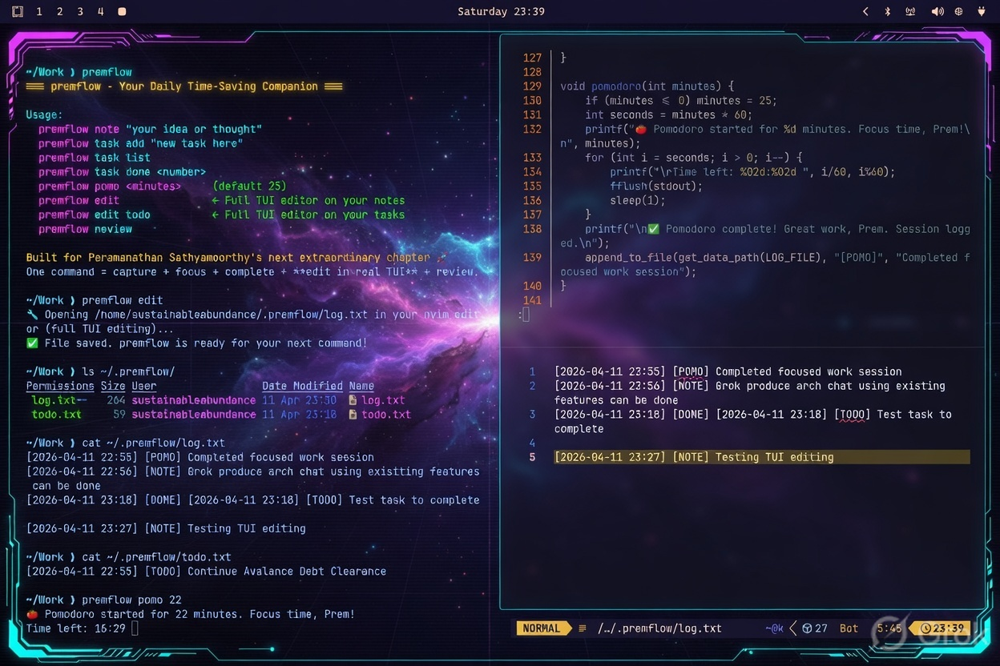
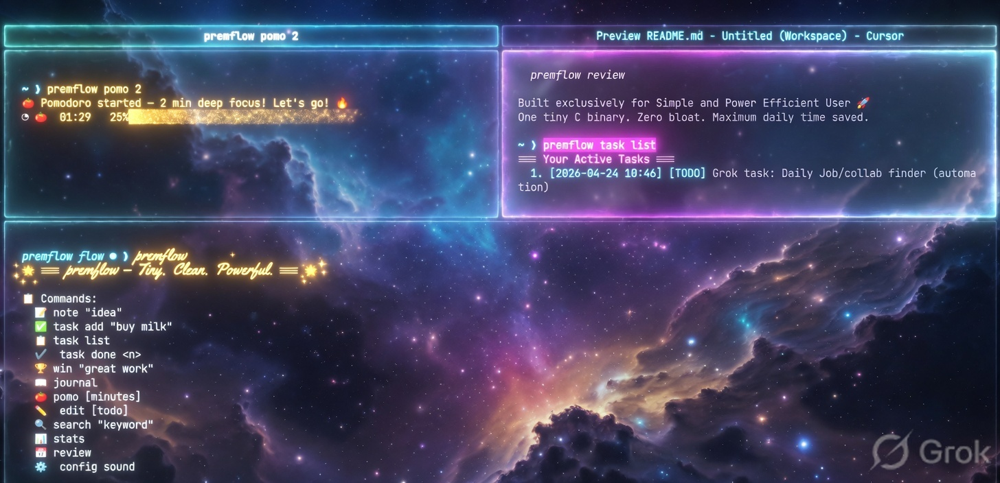
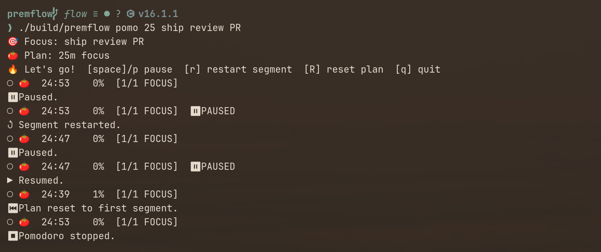
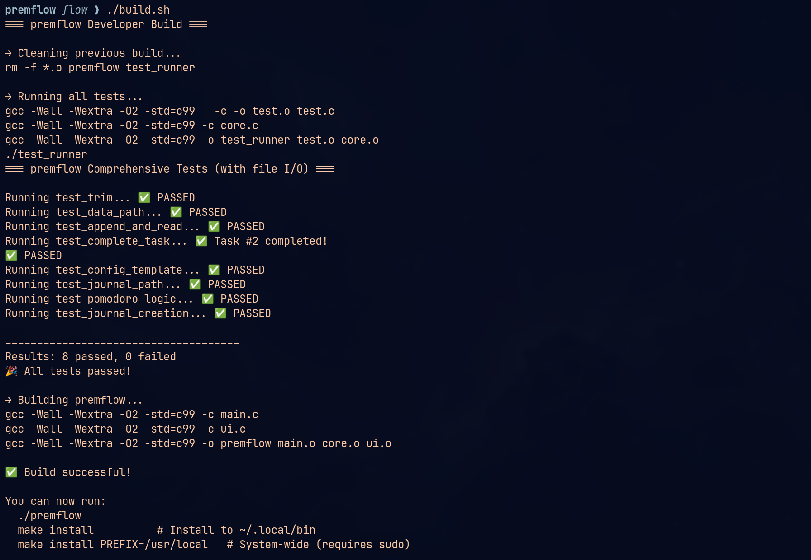
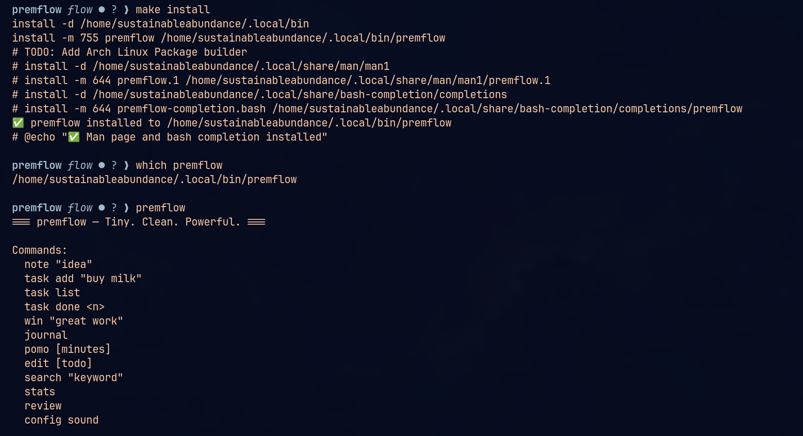
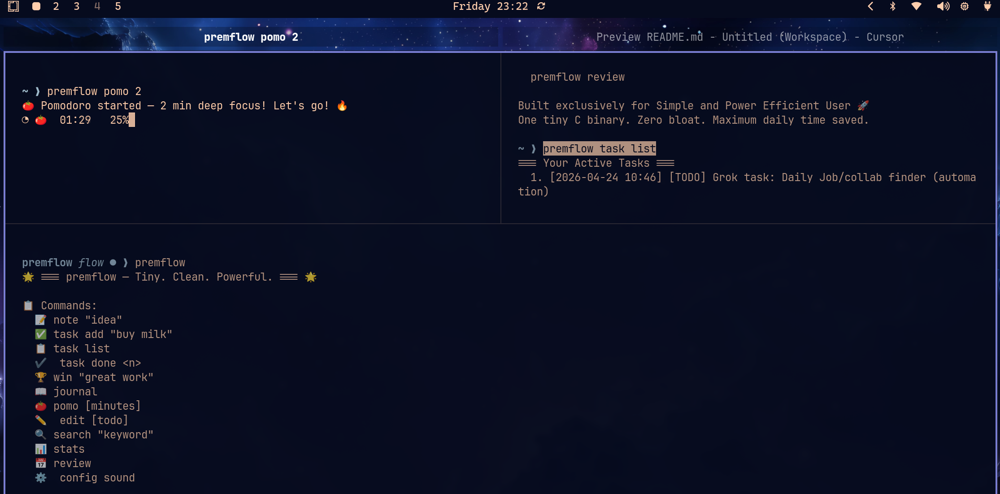

# premflow



**Tiny. Clean. Powerful.**  
A minimalist productivity CLI in pure C — fewer flags, less noise, more signal in your daily log.

### Why you need to use premflow

> Because your tools should get out of the way — not throw a party. premflow 
> delivers a small binary with minimal dependencies, zero bloat, and zero 
> reasons left to procrastinate. Tiny. Clean. Powerful. Like your morning 
> coffee, but with better error handling. It’s the CLI that respects your time 
> so much it refuses to waste any of its own — and honestly, installing a 
> 200MB Electron app just to write “buy milk” is a crime against humanity.
> Your excuses have nowhere to hide.

---

### Features

- 📝 Quick notes & wins logging
- ✅ Task management (add, list, complete)
- 📅 **Smart daily review** — pending todos and recent wins/notes/dones first; pomodoros summarized, not spammed
- 🍅 **Interactive pomodoro** — multi-chunk plans (`20,4,20,4`), session context labels, pause/restart/reset on a TTY, sound + `[POMO]` log on focus end
- 📖 Daily journal with template
- 🔍 Search across logs & tasks
- 📊 Personal stats dashboard
- ⚙️ Customizable sounds via config




### Installation

Requires **CMake 3.14+** and a C11 compiler. The [elomaxz](https://github.com/p10ns11y/elomaxz) MVU library is fetched automatically via CMake `FetchContent`.

```bash
git clone https://github.com/thecuriousts/premflow.git
cd premflow

./build.sh

# Run without installing
./build/premflow
```

**Offline / local elomaxz** (skip network fetch):

```bash
export ELOMAXZ_SOURCE_DIR=/path/to/elomaxz
./build.sh
# or: cmake -B build -DELOMAXZ_SOURCE_DIR=/path/to/elomaxz && cmake --build build
```

#### User-local Install (No sudo)

> Make sure `~/.local/bin` is in your `PATH`.

```bash
make install   # installs to ~/.local/bin (default)
```

The [Makefile](/Makefile) wraps CMake and sets `PREFIX ?= $(HOME)/.local` by default.

### Simplicity by default

Recent work on this branch doubles down on **less ceremony, clearer output**:

| Habit | Why |
|-------|-----|
| `premflow` with no args | Help — **no** `--help` / `-h` to parse or remember |
| `premflow review` | Curated end-of-day view: priorities, wins, notes, dones; POMO sessions counted, not listed line-by-line |
| `premflow review --full` | Raw log tail + full task list only when you need everything |
| `premflow task list` | Full todo file, always |
| `premflow pomo [plan] [context…]` | Focus blocks you can steer: chunk plans, labels, live keys |
| Plain text under `~/.premflow/` | No database, no sync service — grep-friendly logs |

Defaults should answer “what matters today?” Opt in to noise (`review --full`) instead of wading through it every evening.

### Usage

#### Basic commands

```bash
premflow                         # Help — type this, not --help
premflow note "Great idea!"
premflow win "Nailed the demo"
premflow task add "Buy milk"
premflow task list               # All active tasks
premflow task done 2
premflow pomo 25                 # Single focus block (default 25)
premflow pomo 20,4,20,4          # Multi-chunk: focus/break alternating
premflow pomo 25 ship review PR  # Plan + session context (logged on focus end)
premflow pomo deep work on auth  # Context only (default 25m plan)
premflow journal
premflow stats
premflow review                  # Smart review (recommended)
premflow review --full           # Raw dump when debugging or auditing
premflow search "meeting"
premflow edit todo
premflow config sound
```

`premflow --help` is intentionally unsupported (unknown command). Muscle memory: bare binary for help, subcommand for work.

#### Pomodoro (interactive)

First token is a **plan** when it parses as minutes or a comma plan (`25`, `20,4,20,4`); otherwise all words after `pomo` are **session context** with the default 25m plan. Context is shown live and written into each focus `[POMO]` log line.

| Key | Action |
|-----|--------|
| `space` / `p` | Pause / resume (remaining time kept) |
| `r` | Restart current segment to full duration |
| `R` | Reset whole plan to segment 1 |
| `q` | Quit |

Even plan indices are **focus**, odd are **break**. Sound + log fire on focus completion only.



#### Example daily workflow

```bash
# Morning — plan
premflow journal
premflow task add "Finish project proposal"

# Focus (labeled session or full day plan)
premflow pomo 50 ship project proposal
# premflow pomo 25,5,25,5,25,15 deep work day

# Evening — signal, not spam
premflow win "Shipped v2.0"
premflow review                  # Quick curated recap
# premflow review --full         # Uncomment only when you need the raw log
```

### Configuration

Edit sound settings:

```bash
premflow config sound
```

#### Example config (`~/.premflow/config.txt`):

Find out your Linux distro's `PLAYER` and sounds.
Update `POMO_START`, `POMO_COMPLETE`, `TASK_COMPLETE`.

```ini
PLAYER=paplay
POMO_START=paplay /usr/share/sounds/freedesktop/stereo/phone-incoming-call.oga >/dev/null 2>&1
POMO_COMPLETE=paplay /usr/share/sounds/freedesktop/stereo/complete.oga >/dev/null 2>&1
TASK_COMPLETE=paplay /usr/share/sounds/freedesktop/stereo/bell.oga >/dev/null 2>&1
```

Empty value = disable that sound.

---

### Cross-refs (life-os · ensembly · shared data)

premflow is the **micro-capture CLI**. Notes/tasks/journal/pomo live in **`~/.premflow/`** (byte SoT). Other tools **view the same tree** — they do not own a second todo list.

| Peer | Path / link | Role |
|------|-------------|------|
| **Data (SoT)** | `~/.premflow/` | `todo.txt`, `log.txt`, `journal/`, `config.txt` — local only; may hold finance/PII |
| **life-os portfolio card** | `~/life-os/Projects/premflow/README.md` | Product card (status, energy, sessions) — not a parallel inbox |
| **life-os vault view** | `~/life-os/Projects/premflow/capture` → `~/.premflow` | Symlink (gitignored); same files in Obsidian |
| **ensembly integration law** | `~/Work/personal/ensembly/docs/PREMFLOW-FIT.md` | One filesystem SoT, wrapper, privacy (redacted insights for share) |
| **ensembly CLI wrapper** | `node bin/swarm.js flow …` (repo: ensembly) | Invent/list/review via this binary + same `HOME/.premflow` |
| **Day next-act / HITL** | ensembly `turn` / claim / approve | **Not** premflow — do not dump gates into `todo.txt` |

```bash
# From ensembly: ensure vault capture link + call premflow
cd ~/Work/personal/ensembly
npm run flow:link
node bin/swarm.js flow task list   # == premflow task list (same files)
```

**Privacy:** treat `~/.premflow` as private. Shareable digests must use ensembly redaction (`projectCaptureForShare` / `flow path --json`), not raw todo dumps.

---

### Useful Make Targets

```bash
make              # Configure and build (output in build/)
make test         # Run unit tests via ctest
make format       # Apply clang-format to all sources (.clang-format)
make format-check # Fail if sources are not formatted (used in CI)
make clean        # Remove build/ directory
make install      # Install to ~/.local/bin (recommended)
make install PREFIX=/usr/local   # System-wide (requires sudo)
make uninstall    # Remove installed binary
```

Formatting uses [clang-format](https://clang.llvm.org/docs/ClangFormat.html) with the repo `.clang-format` config (requires `clang` on PATH).

Or with CMake directly:

```bash
cmake -B build && cmake --build build
ctest --test-dir build --output-on-failure
cmake --install build --prefix ~/.local
```

### Testing

The test suite includes:

- String trimming logic
- Path generation
- Append / complete task with real temp files
- Config template creation
- Journal path & creation
- Pomodoro plan parse, pause/tick, restart/reset, segment advance, context split + log body
- Full journal template verification

All tests use `mkstemp()` for safe, isolated file I/O testing. Pure pomo session logic is driven without wall-clock multi-minute waits.


### Philosophy

- **Small surface area** — one binary, one shot per shell invocation, no REPL
- **Smart defaults** — help without flags; review that highlights signal; `--full` only when you ask
- **Plain data** — `log.txt`, `todo.txt`, `config.txt` under `~/.premflow/`
- **Honest Unix CLI** — [elomaxz](https://github.com/p10ns11y/elomaxz) MVU (`run_batch`): parse → update → effects → view, then exit
- **Readable C** — named limits instead of magic call literals; UI separate from file logic

Design notes and v2 direction: **[designs/](designs/)** (start with [architecture_v1.md](designs/architecture_v1.md)).

### Architecture (short)

Each command is a fresh process: `parse_argv` → `elomaxz_run_batch` (one message) → `update` / effects / `view`. No REPL or `--help` parser — fewer code paths, faster habit loop. The pomodoro effect is the one long-running in-process loop (TTY keys + pure `PomoSession` ticks). Details, diagrams, and runner comparison: **[designs/architecture_v1.md](designs/architecture_v1.md)**. Interactive pomo design: **[designs/pomo-interactive.md](designs/pomo-interactive.md)**.


### Project Structure

```
premflow/
├── src/
│   ├── premflow.h  # Shared types and core/ui API
│   ├── main.c      # Bootstrap + argv → message + elomaxz_run_batch
│   ├── app.c/h     # Model, messages, init/update/view
│   ├── effects.c   # handle_cmd — file I/O, editor, pomodoro
│   ├── core.c      # Business logic + error handling
│   └── ui.c        # Display / output functions
├── tests/
│   └── test.c      # Comprehensive test suite
├── designs/            # Architecture + v2 ideas (plain markdown)
│   └── architecture_v1.md
├── CMakeLists.txt  # FetchContent(elomaxz) + targets
├── Makefile        # Thin CMake wrapper
└── README.md
```

### Screenshots







### Todos

- AUR packaging for Arch Linux

---

**premflow** — because your tools should get out of the way.

---

Made with ❤️ for focused, productive humans.  
