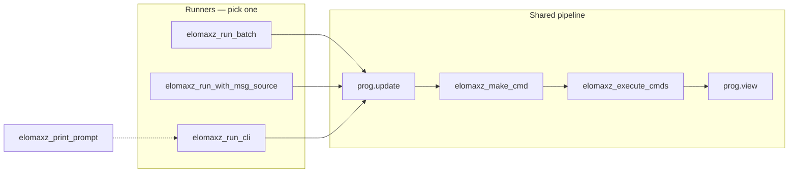
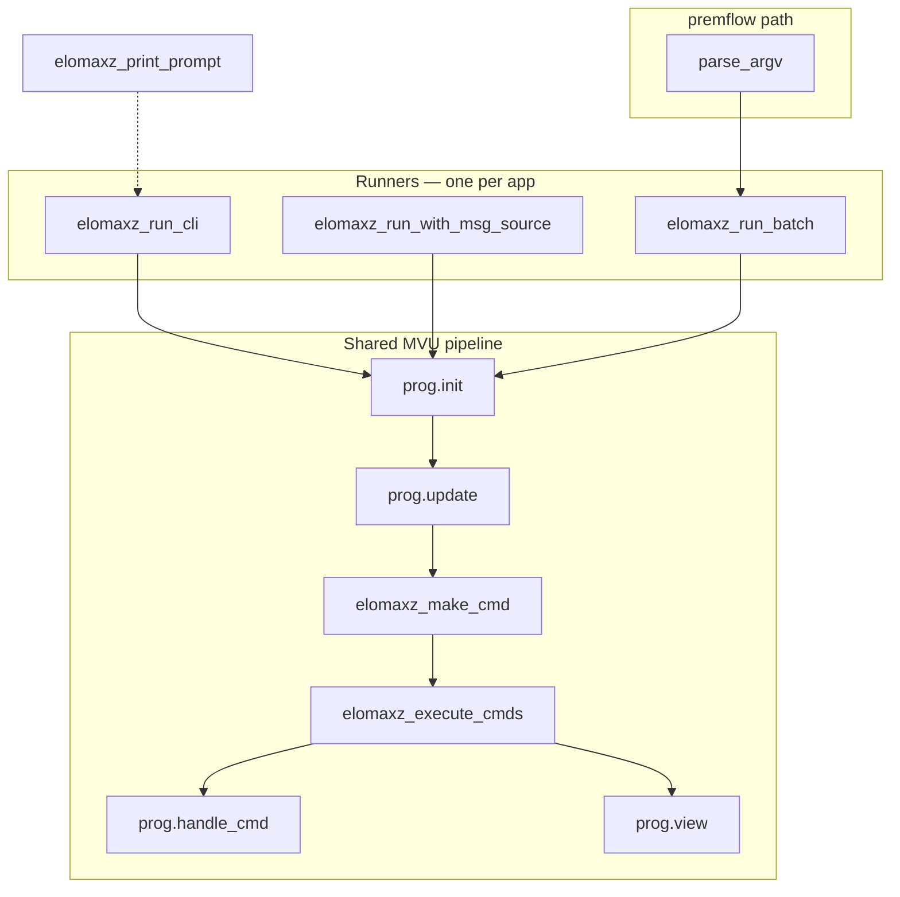
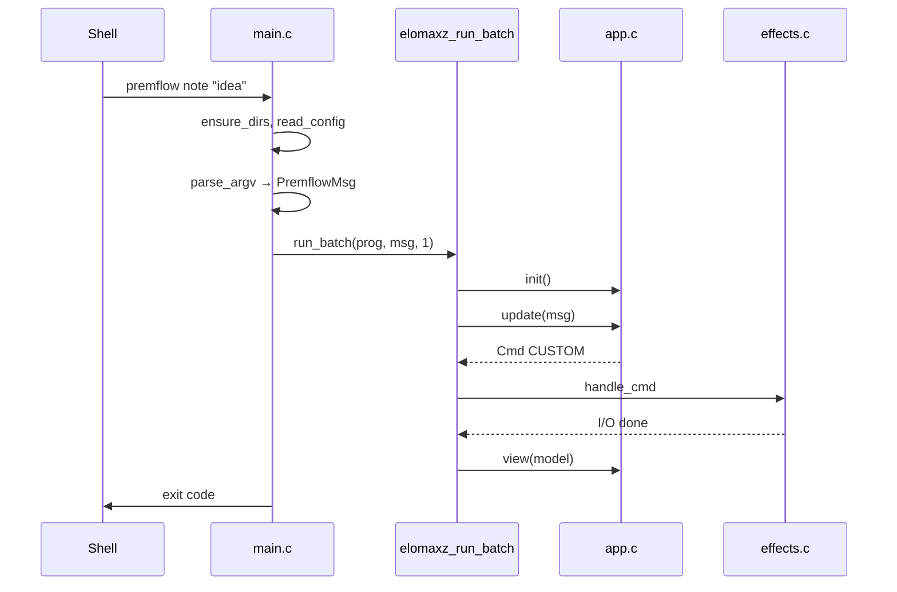

# premflow architecture

premflow is a **one-shot Unix CLI**: each process invocation runs exactly one user command and exits with a status code. The application logic is structured with [elomaxz](https://github.com/p10ns11y/elomaxz) (Model–View–Update + commands/effects), but the **runner** we use is chosen to match the shell, not an interactive app.

## elomaxz public API

These are the functions declared in [elomaxz `include/elomaxz.h`](https://github.com/p10ns11y/elomaxz/blob/master/include/elomaxz.h). Your app fills an `ElomaxzProgram` vtable (`init`, `update`, `view`, `handle_cmd`, `free_*`, …); the functions below are the **framework entry points** that drive the MVU loop.

| Function | Role in MVU | Used by premflow? |
|----------|-------------|-------------------|
| `elomaxz_run_cli` | Demo runner (stdin stub) | No |
| `elomaxz_run_with_msg_source` | Interactive runner | No (v1) |
| `elomaxz_run_batch` | Finite message list runner | **Yes** (`count == 1`) |
| `elomaxz_execute_cmds` | Run imperative shell | Indirectly (called inside `run_batch`) |
| `elomaxz_make_cmd` | Build a `Cmd` from `update` | **Yes** (`CMD_CUSTOM` in `app.c`) |
| `elomaxz_print_prompt` | Print REPL prompt | No |



### `void elomaxz_run_cli(const ElomaxzProgram *prog)`

**Purpose:** Minimal demo loop — not a full CLI integration.

**Behavior:**

1. Calls `prog->init()` and `prog->view(model)`.
2. Prints `> ` via `elomaxz_print_prompt`, reads one line from stdin.
3. On `quit` / `q`, stops; on any other input, prints  
   `[elomaxz] Use elomaxz_run_with_msg_source for production` and stops.
4. Does **not** call `update`, does **not** parse input into `Msg`, does **not** run `handle_cmd`.

**When to use:** Trying elomaxz quickly; upstream treats this as a placeholder.

**premflow:** Not used. A real CLI must turn argv (or stdin) into messages and run `update`; that is what the other two runners do.

---

### `void elomaxz_run_with_msg_source(const ElomaxzProgram *prog, Msg (*next_msg)(void *user_data), void *user_data)`

**Purpose:** Production **interactive** loop — you own message production.

**Behavior:**

1. `init()` → `view(model)`.
2. Loop until `next_msg(user_data)` returns `NULL`:
   - `update(model, msg, cmds_out, &n)` → new model
   - `elomaxz_execute_cmds(prog, cmds, n)` if `n > 0`
   - `free_msg(msg)`
   - `view(model)` after **each** message
3. `free_model` on the final model.

**Contract for `next_msg`:** Allocate and return a `Msg` the framework will free with `prog->free_msg`. Return `NULL` to end the session (e.g. user typed `quit`).

**When to use:** REPLs, games, the elomaxz counter demo (`next_msg_from_stdin`), any process that stays alive and reacts repeatedly.

**premflow:** Not used in v1. Each shell command is a new process; a `next_msg` that only fires once is equivalent to `run_batch` with extra code.

---

### `void elomaxz_run_batch(const ElomaxzProgram *prog, Msg *msgs, size_t count)`

**Purpose:** **Deterministic, finite** message sequence — scripts, tests, one-shot CLIs.

**Behavior:**

1. `init()` (no initial `view`).
2. For each `msgs[i]`:
   - `update` → `elomaxz_execute_cmds` → `free_msg`
3. **One** `view(model)` after all messages.
4. `free_model`.

**Differences from `run_with_msg_source`:**

| | `run_batch` | `run_with_msg_source` |
|---|-------------|------------------------|
| Messages | Pre-built array | `next_msg()` callback |
| `view` | Once at end | After every message |
| Lifetime | Ends when array ends | Ends when `next_msg` returns NULL |

**When to use:** `premflow note "x"`, batch tests, CI driving multiple transitions in one process (`count > 1`).

**premflow:** **Primary entry point** — `parse_argv` builds one `PremflowMsg`, then `elomaxz_run_batch(&prog, (Msg *)&msg, 1)`.

---

### `void elomaxz_execute_cmds(const ElomaxzProgram *prog, Cmd *cmds, size_t n)`

**Purpose:** **Imperative shell** — run side effects after a pure `update`.

**Behavior:** For each non-NULL `cmds[i]`:

1. If `prog->handle_cmd` is set, call `handle_cmd(cmd, &result_msg)`; if `result_msg` is non-NULL, `free_msg(result_msg)`.
2. Always `free_cmd(cmds[i])`.

**When to use:** Called automatically by both runners; you can also call it yourself if you build a custom loop (not needed in premflow).

**premflow:** Not called from `main.c`. `pf_update` fills `cmds_out[]` with `elomaxz_make_cmd(...)`; `run_batch` calls `execute_cmds` internally. Implementation lives in `effects.c` (`pf_handle_cmd`).

**Note:** Runners do **not** feed `result_msg` back into `update`. Async “cmd completes → new message” needs a custom loop or future elomaxz support.

---

### `Cmd elomaxz_make_cmd(CmdType type, void *data, size_t size)`

**Purpose:** Allocate a framework-owned `Cmd` wrapper around your effect payload.

**Behavior:** `malloc`s a `CmdData` with `type`, `data`, `size`, and `on_complete = NULL`. Returns `(Cmd)cmd` or `NULL` on OOM.

**`CmdType` values:** `CMD_NONE`, `CMD_CUSTOM`, `CMD_DELAY`, `CMD_IO_READ`, `CMD_IO_WRITE`, `CMD_NETWORK_SEND`, `CMD_ML_TRAIN_STEP`. The framework does not implement I/O/network/ML itself — your `handle_cmd` interprets the type.

**When to use:** Inside `update`, when a message should trigger side effects without doing I/O in `update` itself.

**premflow:** `emit_effect` in `app.c` uses `CMD_CUSTOM` with a heap-allocated `EffectPayload`; `pf_handle_cmd` in `effects.c` switches on `payload->kind` and runs file/editor/pomo logic.

---

### `void elomaxz_print_prompt(const char *prompt)`

**Purpose:** Small UX helper for interactive apps.

**Behavior:** If `prompt` is non-NULL, `fputs(prompt, stdout)` and `fflush(stdout)`.

**When to use:** REPLs built with `run_cli` (hardcoded `"> "`) or your own `next_msg` reader.

**premflow:** Not used — no interactive prompt; the shell provides the command line.

---

## elomaxz public API (summary)

All six functions from `elomaxz.h`. **Runners** choose how messages enter the loop; **helpers** support effects and interactive UX inside that loop.

| Function | Category | Role | premflow |
|----------|----------|------|----------|
| `elomaxz_run_cli` | Runner | Demo stdin loop; no real `update` / `handle_cmd` | No |
| `elomaxz_run_with_msg_source` | Runner | `next_msg()` until `NULL`; `view` after each message | No (v1) |
| `elomaxz_run_batch` | Runner | Fixed `Msg[]` + `count`; `view` once at end | **Yes** (`count == 1`) |
| `elomaxz_execute_cmds` | Effect runner | Calls `handle_cmd`, frees cmds (and result msgs) | Indirectly (inside `run_batch`) |
| `elomaxz_make_cmd` | Effect builder | Allocates `CmdData` for `update` to enqueue | **Yes** (`app.c` → `CMD_CUSTOM`) |
| `elomaxz_print_prompt` | UX helper | Prints/flushes a REPL prompt string | No |

**Runners only** — same pipeline, different message source:

| Runner | Message source | Process lifetime | Intended use |
|--------|----------------|------------------|--------------|
| `elomaxz_run_cli` | Built-in stdin stub | Exits after one line | Demo / placeholder |
| `elomaxz_run_with_msg_source` | `next_msg(user_data)` | Until `NULL` | REPL, games, counter demo |
| `elomaxz_run_batch` | `msgs[0..count-1]` | Ends when array consumed | **premflow**, tests, scripts |



## Why `elomaxz_run_batch` for premflow

### 1. The product model is already “one message per process”

Users run:

```bash
premflow note "idea"
premflow task list
```

The shell starts a **new** `premflow` process each time. There is no session inside the binary: configuration is read from disk, the command runs, stdout/stderr are produced, and the process exits. That is exactly a **batch of one message**:

```c
PremflowMsg *msg = parse_argv(argc, argv);
elomaxz_run_batch(&prog, (Msg *) &msg, 1);
return runtime.exit_code;
```

Using `elomaxz_run_with_msg_source` would mean either:

- Keeping the process alive in a REPL (a different product), or
- Implementing `next_msg()` that returns one message and then `NULL` — the same work as batch, with more boilerplate and a less honest API.

### 2. Same MVU pipeline, minimal glue

`elomaxz_run_batch` still runs the full cycle for each message:

1. `init()` — initial model  
2. For each message: `update` → `elomaxz_execute_cmds` → free message  
3. `view()` on the final model  
4. `free_model`

premflow does not reimplement that loop in `main.c`. Side effects stay in `handle_cmd` (`effects.c`); pure decisions stay in `update` (`app.c`). The runner guarantees consistent ordering and cleanup.

### 3. Testability without changing the architecture

`count` can be greater than one in tests (e.g. simulate `note` then `stats` in one process) without switching runners. Production CLI keeps `count == 1`; tests can grow into multi-step batches later.

### 4. Clear separation from “imperative main”

A plain `switch (argv[1])` in `main` would mix parsing, state transitions, and I/O. The batch runner forces:

| Layer | File | Role |
|-------|------|------|
| Shell adapter | `main.c` | Bootstrap dirs/config, `parse_argv`, run batch, exit code |
| Functional core | `app.c` | `update` / `view`, schedule `CMD_CUSTOM` effects |
| Imperative shell | `effects.c` | `handle_cmd` → `core.c` / `ui.c` |

That matches elomaxz’s **functional core, imperative shell** design.

### 5. Honest about what we do *not* need

| Pattern | Why we skip it for v1 |
|---------|------------------------|
| `elomaxz_run_cli` | Upstream marks it as non-production |
| `elomaxz_run_with_msg_source` | No REPL; would fight Unix “one command, one exit code” |
| Feeding `handle_cmd` results back into `update` | Batch runner does not loop on effect replies; premflow uses one-shot cmds and `PremflowRuntime` for exit status — enough for CLI |

## End-to-end flow (single command)



## When you *would* pick another runner

- **Interactive premflow REPL** (`premflow>` with many subcommands in one process) → `elomaxz_run_with_msg_source` + `next_msg` reading stdin.  
- **Upstream counter / teaching demo** → same interactive runner (see elomaxz `examples/counter`).  
- **CI or unit tests driving multiple transitions** → `elomaxz_run_batch` with `count > 1` (same code path as production).

## Related files

- [`src/main.c`](../src/main.c) — bootstrap + `elomaxz_run_batch`  
- [`src/app.c`](../src/app.c) — `pf_init` / `pf_update` / `pf_view`  
- [`src/effects.c`](../src/effects.c) — `pf_handle_cmd`  
- [elomaxz `include/elomaxz.h`](https://github.com/p10ns11y/elomaxz/blob/master/include/elomaxz.h) — runner declarations
