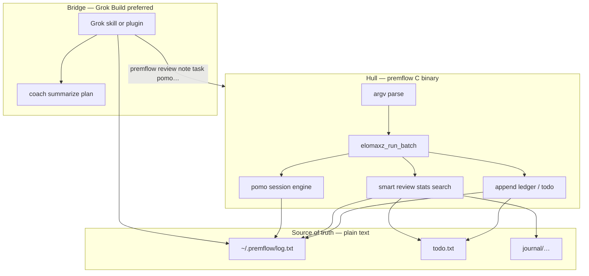
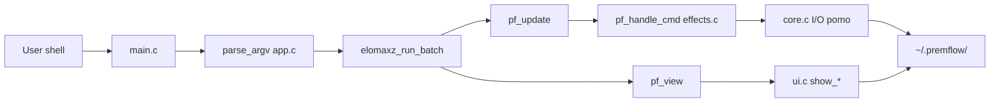
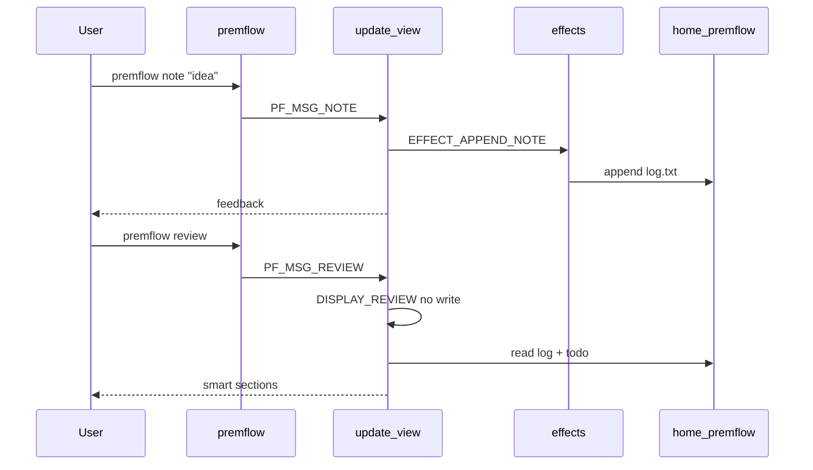
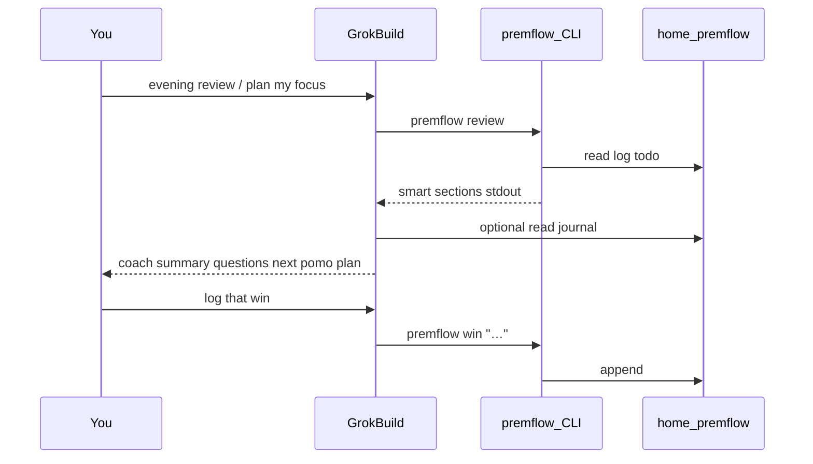
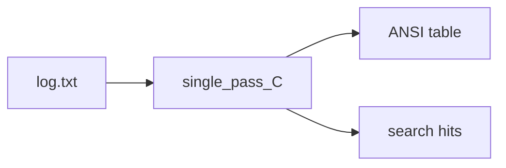
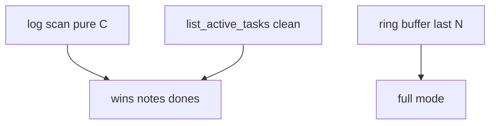
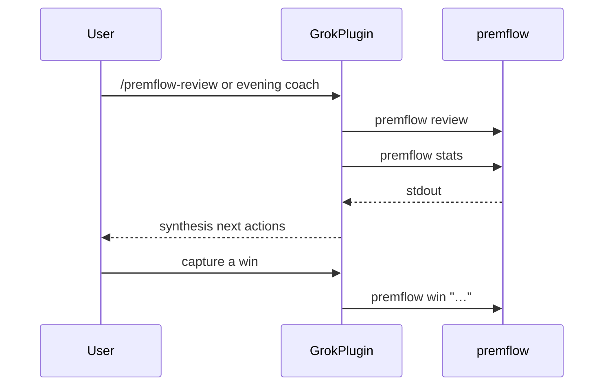
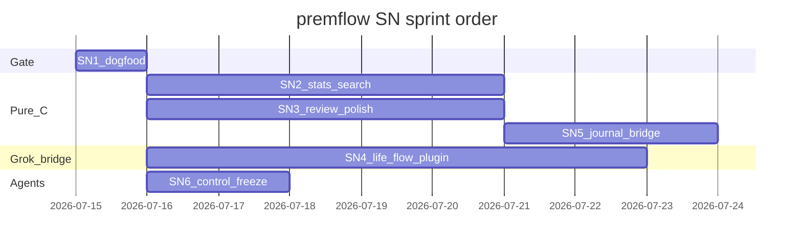
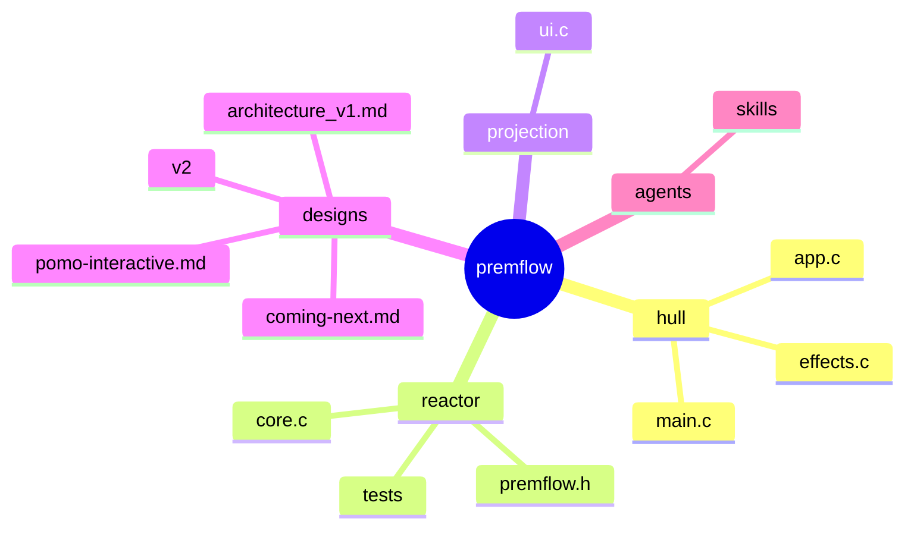

# premflow — coming next (stellar roadmap)

**Ship computer for a human day:** capture signal, protect focus, project the ledger — and let **Grok Build drive premflow** (skills/plugin) when you want a strong coach, without stuffing a model into the C binary.

---

## §0 · Mission

Keep premflow a **tiny pure-C one-shot CLI** over human-editable plain text, while the daily loop (capture → focus → review → journal) stays sharp in C and can be **orchestrated and coached by Grok Build** via a skill/plugin that runs and reads premflow — preferred over slow, low-quality local LLMs in the product path.

---

## §0b · Ten-year thrive picture (2036)

**Iron-peak fused abstraction:**  
**Personal Activity Ledger Reactor** = append-only event stream (`log.txt`) + open work set (`todo.txt`) + day lens (journal) + **smart projection** (`review` / stats / search) + **Grok as the high-quality AI bridge** that *uses* premflow as tools (CLI + plain files), not a second database.

Trace today:

| Piece | Real paths |
|-------|------------|
| One-shot MVU hull | `src/main.c` (`elomaxz_run_batch`), `src/app.c` (`pf_update` / `pf_view`) |
| Ledger writes | `src/core.c` (`append_entry`), `src/effects.c` (`EFFECT_*`) |
| Smart projection | `src/ui.c` (`show_review`, `show_stats`, `show_search`) |
| Focus engine | `src/core.c` (`pomo_plan_parse`, `pomo_session_*`, `start_pomodoro`) |
| Design memory | `designs/v2/premflow_v2.0.md`, `designs/architecture_v1.md`, `.stellarfusion/state.json` |
| Agent surface | `.agents/skills/*`, this doc §15 |



| Layer 2036 | Role | Durable? |
|------------|------|----------|
| Kernel | Plain-text ledger + MVU one-shot + pure pomo engine | Decade |
| Bridge | C projections (review/stats) + `make test` | Evolves |
| AI edge | **Grok Build plugin/skills** that shell premflow + read SoT | Swappable model, same CLI contract |
| Legacy option | Local ollama helper (v2 draft) | Fallback only if offline-only required |

**Thrive bet confidence:** ~80% that **CLI SoT + strong remote/agent model (Grok)** beats embedding weak local 7B models into every personal tool.

---

## §1 · Scorecard (shipped vs open)

| Area | Grade | One line | Evidence |
|------|-------|----------|----------|
| One-shot MVU CLI | A | argv → one msg → batch runner → exit | `src/main.c`, `designs/architecture_v1.md` |
| Capture surface | A | note / win / task / journal / edit | `src/app.c` (`parse_argv`), `src/effects.c` |
| Smart review | B+ | Curated default; POMO volume; `--full` raw | `src/ui.c` (`show_review`), README “Simplicity by default” |
| Interactive pomo | A | Chunk plan, context, pause/restart/reset | `src/core.c`, `designs/pomo-interactive.md`, `tests/test.c` |
| Stats | C | Shell `grep -c` via `system()` | `src/ui.c` (`show_stats`) |
| Search | C | Shell `grep` via `system()` | `src/ui.c` (`show_search`) |
| Pure unit tests | B+ | Core paths + pomo engine; no LLM | `tests/test.c`, `CMakeLists.txt` (`test_runner`) |
| Local-LLM-in-product path | C | v2 draft; **deprioritized** vs Grok bridge | `designs/v2/premflow_v2.0.md`, §8 |
| Grok → premflow bridge | C | Skills for *coding* exist; **life-flow plugin** not shipped yet | `.agents/skills/*`, §15 |
| Agent steerability | B | Project skills + this roadmap | `.agents/skills/*`, this file |
| data_path hazard | B | Documented; callers must copy | `src/core.c` (`data_path`), `.stellarfusion/state.json` |

---

## §2 · System map today



| Module | Responsibility |
|--------|----------------|
| `src/main.c` | dirs, config, program vtable, single-msg batch |
| `src/app.c` / `app.h` | Msg model, parse, pure update, display kind |
| `src/effects.c` | Side effects: files, editor, pomo launch |
| `src/core.c` / `premflow.h` | paths, append, tasks, **pomo engine**, sounds |
| `src/ui.c` | help, stats, review, search presentation |
| `tests/test.c` | pure core + pomo (no TTY required) |

**Fused insight (fusion-sage):** premflow is not “a todo app with a timer.” It is a **ledger + projection + focus reactor**. Every new feature should either (1) write cleaner ledger events, (2) project the ledger with less noise, or (3) protect focus. **Grok is the preferred projection accelerator** — it *drives* premflow and reads `~/.premflow/`; it is not a second SoT and not a reason to ship ollama inside the ELF.

---

## §3 · Precedence / data flow



**Write path:** note/win/task/pomo-complete/done → append.  
**Read path:** review/stats/search/task list → pure view (except journal opens editor).  
**Invariant:** AI must not mutate ledger without an explicit user command later (edit/journal).

---

## §4 · Musk 5-step on the backlog

| Step | Application |
|------|-------------|
| 1. Question requirements | Do we need an LLM in-core? **No.** Do we need GUI? **No.** Do we need smart review default? **Yes (shipped).** |
| 2. Delete | Delete `system(grep)` stats/search once pure-C exists; delete POMO line spam from default review (done). |
| 3. Simplify | One plan string + context for pomo; bare `premflow` = help (no `--help`). |
| 4. Accelerate | Dogfood gate before features; agents execute SN cards with `make test`. |
| 5. Automate | Optional AI helper + Grok skills after pure projection is clean. |

---

## §5 · Trajectory forces (2036)

| Force | P(horizon) | Effect | Response | Confidence |
|-------|------------|--------|----------|------------|
| Strong agent harnesses (Grok Build) | High | Best coach quality lives *outside* tiny CLIs | Ship **premflow plugin/skills** that Grok runs | High |
| Local 7B “in every tool” disappoints | High | Slow + weak vs frontier models | Prefer Grok path; keep ollama as offline fallback only | High |
| Cloud “AI notebooks” absorb capture | Med | Competing for daily log | Win on **offline SoT + grep + 36KB** | Med |
| Agent coding becomes default | High | Repo + life-flow both agent-steerable | Roadmap + skills + dogfood cards | High |
| Privacy / offline days | Med | Need no-network mode | Pure C review always works; Grok optional | High |
| Tailwind: plain text + POSIX | High | Tools compose forever | Keep SoT human-editable | High |

---

## §6 · Guardrails — refuse vs build

| Refuse (drag) | Build toward 2036 |
|---------------|-------------------|
| Embed ollama/llama.cpp in `premflow` | Grok skill/plugin that **calls** premflow + reads SoT |
| Defaulting life-coach to weak local models | Grok as primary coach quality; local LLM only if offline-hard requirement |
| GUI / Electron / daemon as required path | One-shot CLI remains primary; Grok orchestrates it |
| SQLite as required SoT | Plain text forever; optional sidecars only |
| REPL conversion of entire UX | Stay argv one-shot (`elomaxz_run_batch`) |
| Auto-mutate journal without user confirm | Draft in chat or editor; user commits to files |
| Agent free-for-all renames without dogfood | SN-1 dogfood gate first |
| Treating coding skills as the whole story | Also ship **daily-flow** premflow plugin for Grok |

---

## §7 · UX / product flow (real CLI)

Not a product fiction — grounded in shipped behavior.

### Daily arc


| Moment | Command | Preferred default | Friction today |
|--------|---------|-------------------|----------------|
| Orient | `premflow` | Help (no `--help`) | Users may still type `--help` → unknown |
| Plan day | `journal`, `task add` | Template + editor | Manual; no “from review” bridge yet |
| Capture | `note`, `win`, `task` | One line, append | Fast — keep |
| Focus | `pomo [plan] [context…]` | 25m; space/p/r/R/q | Needs TTY for keys; non-TTY still ticks |
| Midday | `task list` / `done n` | Full list | Review still shows raw TODO prefixes |
| Evening | `review` | Smart; hide POMO lines | Stats shell-out ugly; no AI coach |
| Audit | `review --full` | Opt-in noise | `system(tail)` |
| Search | `search term` | Substring | Shell grep; no semantic |
| Sound | `config sound` | paplay templates | Fine |

### UX principles (lock)

1. **Signal default, noise opt-in** — `review` vs `review --full`.
2. **Context is free-form text** — pomo labels land in `[POMO]` log (`pomo_format_log_body`).
3. **Plan is data** — `20,4,20,4` encodes long-break policy; no magic N-rule.
4. **Human owns the file** — `$EDITOR` for journal/edit; AI drafts only later.
5. **Small binary** — features that need models live outside the hull.

### Preferred flows (dogfood scripts)

```bash
# Morning
premflow journal
premflow task add "Ship review polish"

# Focus block
premflow pomo 25 ship review polish
# or: premflow pomo 20,4,20,4 deep work on auth

# Capture
premflow note "edge case for pause"
premflow win "landing page copy"

# Evening
premflow review
premflow stats
# With Grok plugin (preferred): "evening review" → agent runs premflow + coaches
```

---

## §8 · AI integration — Grok drives premflow (preferred); local LLM optional

**Intent (clarified):** optimize the *daily flow* by letting **Grok Build use and control premflow** as a tool surface (skill and/or installable plugin) — not by bolting a slow local model into the C product. The older ollama-centric draft in `designs/v2/premflow_v2.0.md` remains a useful *offline fallback* design, not the north star.

### Two paths (priority)

| Priority | Path | Quality / speed | When |
|----------|------|-----------------|------|
| **P0** | **Grok Build** skill/plugin → runs `premflow …`, reads `~/.premflow/`, coaches in session | Frontier model quality | Default “AI for my day” |
| **P1** | Pure C `review` / stats / search | Instant, offline | Always available |
| **P2** | Local helper (`review --ai` / ollama) | Often slower / weaker on laptop | True offline-only machines |

### Contract

| Rule | Detail |
|------|--------|
| SoT | `~/.premflow/*.txt` stays human-editable; Grok **prefers** writing via `premflow note|win|task|…` so the ledger format stays correct |
| Core binary | No LLM library link; size stays small |
| Grok plugin | Ships procedures + optional slash commands that *invoke* premflow; does not replace the binary |
| Local LLM | Opt-in only; never blocks bare `review` |
| Privacy | User chooses when Grok may read logs; no silent cloud from C core |
| Failure | No Grok session → CLI still full-featured |

### Architecture (preferred)



### What Grok should do with premflow (life-flow plugin)

| Intent | Grok action | premflow / files |
|--------|-------------|------------------|
| Morning orient | Run review + task list; propose top 3 | `premflow review`, `task list` |
| Start focus | Suggest plan+context; start or remind | `premflow pomo 25 …` or `20,4,…` |
| Capture | Emit correct CLI, not raw file edits | `note` / `win` / `task add` |
| Evening coach | Synthesize from review + journal intention | `review`, `stats`, journal files |
| Drift check | Compare pomos+context labels to intention | log `[POMO]` lines + journal |
| Code change | Separate: coding skills + SN cards | repo skills, not life-flow |

### Local LLM (P2) — kept small

If you ever need no-Grok offline AI: external helper + ollama as in v2 — still **outside** the ELF. Do not make it the default story in help text.

### Non-goals

- Auto-commit invented accomplishments to the log without you  
- Replacing premflow with a chat-only notebook  
- Requiring a local GPU for basic CLI  

---

## §9 · Blueprint cards (SN-*)

### SN-1 · Dogfood gate (no product code)

**Problem:** Agents and humans implement without a frozen baseline of help + review + tests.


| File | Work |
|------|------|
| (none required) | Run and record baseline |
| `designs/coming-next.md` | This card is the gate |

**Done when:** `make test` green; `./build/premflow` shows note/task/pomo/review; `./build/premflow review` exits 0.

**Verify:**

```bash
make test
./build/premflow | grep -E 'note|task|pomo|review'
./build/premflow review
```

---

### SN-2 · Pure stats and search (delete system greps)

**Problem:** `show_stats` / `show_search` shell out; fragile, ugly, hard to test.



| File | Work |
|------|------|
| `src/core.c` | `compute_log_counts`, optional search iterator |
| `src/ui.c` | rewrite `show_stats` / `show_search` |
| `tests/test.c` | counts on temp log file |

**Done when:** No `system(` in stats/search path; unit test proves count of `[POMO]`/`[WIN]` on fixture file.

**Verify:** `make test`; `premflow stats` prints table without shell noise; `nm`/`grep system` limited to intentional remainders.

---

### SN-3 · Review display polish (clean todos, no shell full)

**Problem:** Review todos show raw prefixes; `--full` uses `system(tail)`; dups noise.



| File | Work |
|------|------|
| `src/core.c` | clean todo line render; optional categorize helper |
| `src/ui.c` | `show_review` polish; C full path |
| `tests/test.c` | clean-line / categorize fixtures |

**Done when:** Default review shows `1. buy milk` not `[ts] [TODO]…`; `--full` without shell tail.

**Verify:** Dogfood on real `~/.premflow` + fixture tests.

---

### SN-4 · Grok life-flow plugin (premflow as tools)

**Problem:** Coding agents can edit the repo, but Grok does not yet have a first-class **daily-flow** package that runs premflow and coaches from the ledger — so “AI for my day” defaults to weak local models or ad-hoc chat.



| File | Work |
|------|------|
| `.grok/skills/premflow-flow/` or plugin dir | SKILL.md: when to run which CLI; never invent log lines |
| optional `commands/` | `/premflow-review`, `/premflow-focus`, `/premflow-capture` |
| optional hooks | none required; SessionStart can print `premflow review` tip |
| `designs/coming-next.md` §8 / §15 | contract for tool use |

**Done when:** From a Grok session you can run a documented flow that (1) invokes real `premflow` commands, (2) reads only `~/.premflow` + CLI output, (3) proposes next pomo/context without writing the log unless you ask for a capture command.

**Verify:** Dogfood script or skill checklist: `premflow review` output appears in agent context; `premflow note "…"` creates a real log line; no ollama required.

**Note:** Local `review --ai` (v2) stays a **later optional** P2 card if offline-hard mode is still wanted after the Grok bridge ships.

---

### SN-5 · Journal bridge from review (pure C first)

**Problem:** Review signal does not flow into journal template.

| File | Work |
|------|------|
| `src/effects.c` / `app.c` | `journal --from-review` or flag |
| `src/ui.c` / `core.c` | extract top wins/dones text |

**Done when:** One command appends “From review” bullets then opens editor.

**Verify:** Temp `HOME` dogfood; no AI required.

---

### SN-6 · Agent control surface freeze

**Problem:** Future agents re-scout the whole tree every time.

| File | Work |
|------|------|
| `.agents/skills/` | keep explore/mvu skills aligned with this roadmap |
| `designs/coming-next.md` | SN cards stay source of truth |
| README | pointer stays current |

**Done when:** New agent can open this file + run SN-1 without reading all of v2.

**Verify:** Structure checklist (see verification harness / agent self-check).

---

## §10 · Scope lock (user decisions)

| Decision | Locked |
|----------|--------|
| Overhaul for this effort | **Roadmap + control guide** (not full SN rewrite) |
| LLM in core | **No** |
| Data model | Plain text under `~/.premflow/` |
| Interactive form | One-shot CLI (+ live pomo loop inside process) |
| Metaphor | Spacecraft / ship computer (this doc) |

---

## §11 · Gantt / sprint order



**Execute order:** SN-1 → **SN-4 (Grok life-flow)** can start in parallel with SN-2/3 → SN-5 → SN-6. Pure-C polish still compounds Grok’s inputs (cleaner review stdout).

---

## §12 · Monitoring signals

| Signal | Healthy | Alarm |
|--------|---------|-------|
| `make test` | 0 failed | Any fail |
| Binary size | ≲ 100KB stripped goal | Sudden multi-MB jump |
| `system(` in ui stats/search | 0 after SN-2 | New greps |
| Review dogfood | Pending first, POMO count only | POMO line spam returns |
| Grok life-flow | Uses `premflow` CLI for writes | Direct file invents / skips CLI |
| Agent entry | This file + SN-1 | Agents invent architecture |

---

## §13 · Done log

| When | What |
|------|------|
| 2026-06-03 | Phase-1 smart review; fusion state in `.stellarfusion/state.json` |
| 2026-06-03 | v2 LLM design draft `designs/v2/premflow_v2.0.md` |
| 2026-07 | Interactive multi-chunk pomo + context (`designs/pomo-interactive.md`) |
| 2026-07-15 | Stellar roadmap; **reframed AI path:** Grok uses premflow (plugin/skills), local LLM deprioritized |

---

## §14 · File touch mindmap



---

## §15 · How Grok Build uses and controls premflow

**Yes — this is the point:** Grok Build can **drive premflow** (as skills and/or an installable plugin) so the daily loop gets a strong model without local ollama quality/speed pain. Two complementary jobs:

| Job | What Grok does | Package |
|-----|----------------|---------|
| **A. Life flow** | Run `premflow` for capture/focus/review; coach from stdout + `~/.premflow` | SN-4 life-flow skill/plugin (**build this**) |
| **B. Code flow** | Change the C repo against SN cards; `make test` | Existing `.agents/skills/*` + this roadmap |

You already control Grok with the usual harness knobs (skills, plugins, hooks). Premflow stays the **fast, offline, correct ledger**; Grok stays the **judgment layer**.

### Skills vs plugins (how the harness works)

| Concept | What it is | Where Grok looks |
|---------|------------|------------------|
| **Skill** | `SKILL.md` procedure package | `.grok/skills`, `.agents/skills`, `~/.grok/skills`, compat dirs |
| **Plugin** | Bundle: skills + slash commands + agents + hooks + MCP | `.grok/plugins/`, `~/.grok/plugins/`, `grok plugin install`, `/plugins` |
| **Hook** | Lifecycle script (SessionStart, PreToolUse, …) | `~/.grok/hooks/`, plugin `hooks/hooks.json` |
| **Project rules** | Standing constraints | `AGENTS.md`, `.agents/rules` |

Guides on this machine: `~/.grok/docs/user-guide/08-skills.md`, `09-plugins.md`, `10-hooks.md`.

### How Grok should control *premflow* (life flow)

```text
You are coaching a day. Use premflow as the system of record.

1. Orient:   run `premflow review` and `premflow task list`
2. Plan:     propose a pomo plan + context string (user confirms)
3. Focus:    `premflow pomo 25 <context>` or chunk plan (user may run in their TTY)
4. Capture:  `premflow note|win|task add "…"` — prefer CLI over hand-editing log.txt
5. Close:    `premflow review` + `premflow stats`; compare to journal intention
6. Never invent ledger lines; if unsure, ask or show the command for the user to run
```

**Why CLI not raw files:** format, timestamps, and side effects (sounds, DONE cleaning) stay correct.

**Why Grok not local LLM in C:** quality and latency of frontier models; premflow stays tiny and always works offline for capture/focus/review without a GPU.

### Install / control surfaces (harness)

| Action | How |
|--------|-----|
| See skills/plugins | TUI `/plugins` (or `Ctrl+L` Plugins tab); Skills tab lists skills |
| Install a plugin | `grok plugin install <path|url> --trust` or Marketplace `i` |
| Enable/disable | Plugins tab `Space`; `grok plugin list` |
| Reload | Plugins tab `r` or restart session |
| Project skills today | `.agents/skills/*` (coding); life-flow skill = SN-4 deliverable |

### Coding skills already in this repo

| Skill | Use when |
|-------|----------|
| explore-repo-readonly | Map structure before CMake/MVU |
| mvu-refactor-plan | elomaxz refactors |
| src-tree-reorganize | Layout under `src/` |
| subagent-delegation / subagent-explore-report | Broad readonly exploration |

Roadmap / fusion skills may live in your user skill dirs (`stellar-roadmap`, `fusion-sage`, …).

### Playbook A — evening coach (life flow)

```text
1. premflow review
2. premflow stats   # after SN-2, pure C; until then still fine
3. Read today's journal if present
4. Reply: 3 wins, open loops, suggested tomorrow intention, next focus block
5. If user agrees to capture: premflow win "…" / task add "…"
```

### Playbook B — implement an SN card (code flow)

```text
Goal: SN-2 pure stats/search
1. Read designs/coming-next.md §9 SN-2
2. Implement + tests; make test
3. ./build/premflow stats
4. Stop at card boundary
```

### Config knobs (optional)

```toml
# ~/.grok/config.toml
[skills]
# paths = ["~/my-team-skills"]
# disabled = []
```

---

## §16 · References

| Source | Use |
|--------|-----|
| `designs/architecture_v1.md` | MVU / elomaxz runner choice |
| `designs/v2/premflow_v2.0.md` | LLM + pure-C polish depth |
| `designs/pomo-interactive.md` | Focus UX + engine |
| `.stellarfusion/state.json` | Fused concepts + quality debt |
| `README.md` | User-facing defaults |
| `src/main.c`, `app.c`, `core.c`, `ui.c`, `effects.c` | Shipped code |
| `tests/test.c` | Unit gate |
| `~/.grok/docs/user-guide/08-skills.md` | Skills model |
| `~/.grok/docs/user-guide/09-plugins.md` | Plugin install/control |
| `~/.grok/docs/user-guide/10-hooks.md` | Hooks |
| collab-finder blueprint style | SN cards / done-when (stellar-roadmap provenance) |

---

## ⚡ Fusion Surplus

**Invariant:** *premflow owns the ledger; Grok owns judgment; local LLMs are optional understudies.*

Codify:

> Writes go through `premflow` CLI (or deliberate editor). Grok coaches by **running and reading** that system. Never embed a model in the ELF to “add AI.”

That one rule answers “plugin vs ollama vs core” and saves re-litigating v2 every session.

---

**Plain rule:** Keep the binary tiny and true; let Grok drive it when you want a real coach.
