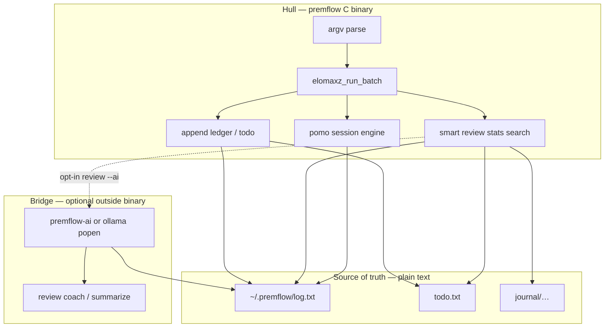
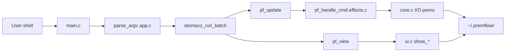
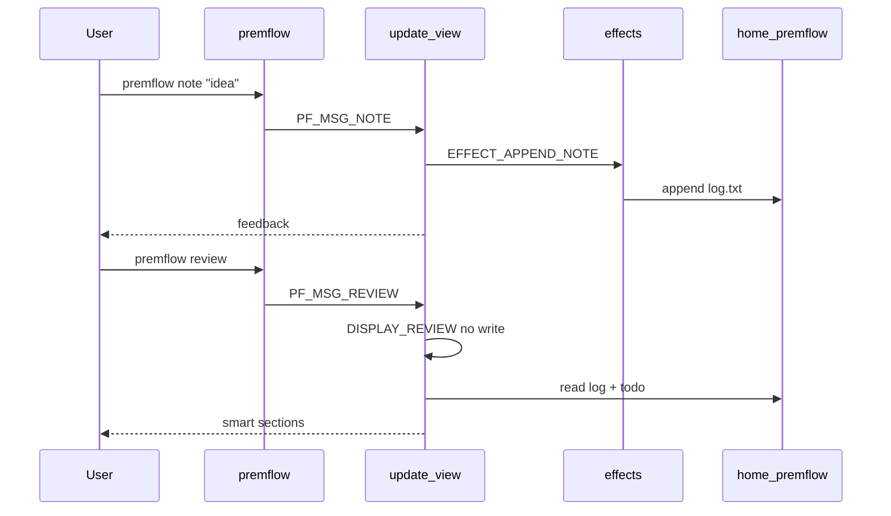
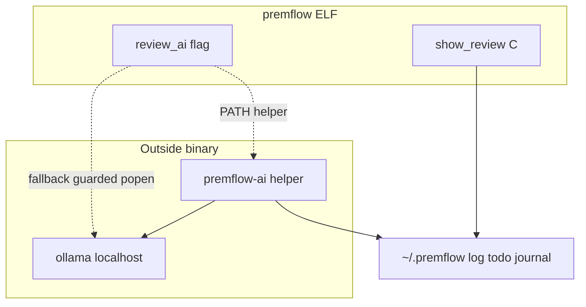
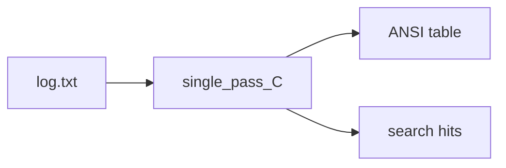
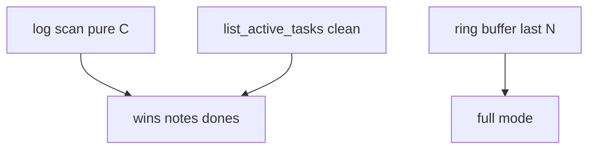
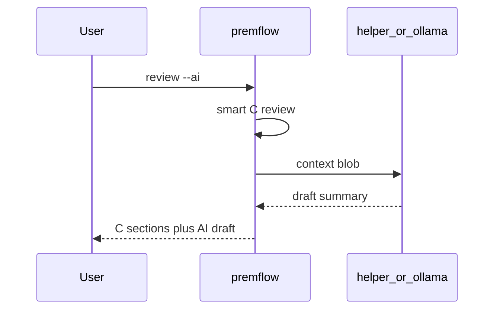
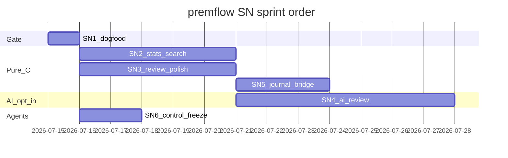
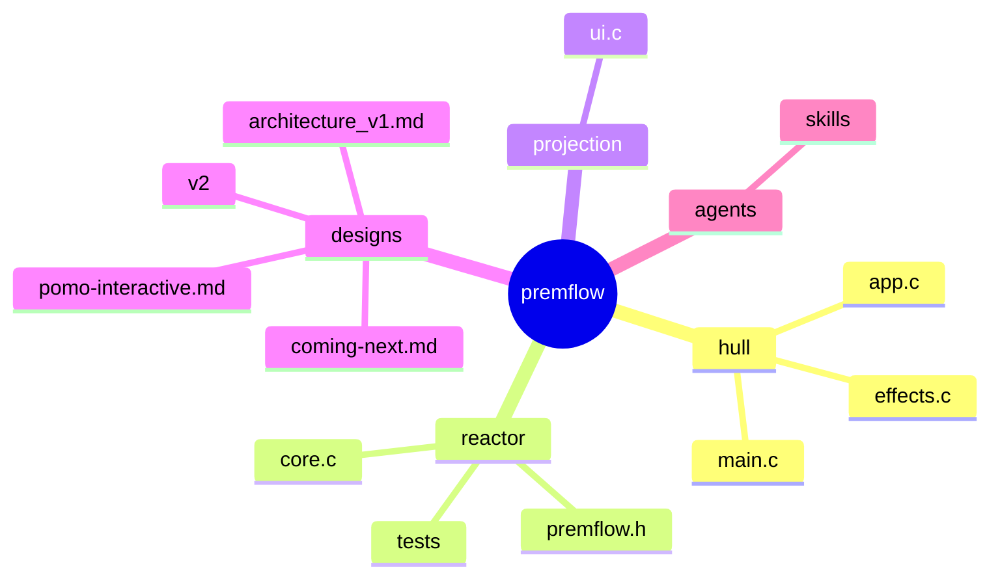

# premflow — coming next (stellar roadmap)

**Ship computer for a human day:** capture signal, protect focus, project the ledger, optionally ask a local coach — never bloat the hull.

---

## §0 · Mission

Keep premflow a **tiny pure-C one-shot CLI** over human-editable plain text, while the daily loop (capture → focus → review → journal) becomes sharper, more steerable, and **optionally** LLM-augmented outside the core binary.

---

## §0b · Ten-year thrive picture (2036)

**Iron-peak fused abstraction:**  
**Personal Activity Ledger Reactor** = append-only event stream (`log.txt`) + open work set (`todo.txt`) + day lens (journal) + **smart projection** (`review` / stats / search) + **optional external AI bridge** (never inside `premflow` ELF).

Trace today:

| Piece | Real paths |
|-------|------------|
| One-shot MVU hull | `src/main.c` (`elomaxz_run_batch`), `src/app.c` (`pf_update` / `pf_view`) |
| Ledger writes | `src/core.c` (`append_entry`), `src/effects.c` (`EFFECT_*`) |
| Smart projection | `src/ui.c` (`show_review`, `show_stats`, `show_search`) |
| Focus engine | `src/core.c` (`pomo_plan_parse`, `pomo_session_*`, `start_pomodoro`) |
| Design memory | `designs/v2/premflow_v2.0.md`, `designs/architecture_v1.md`, `.stellarfusion/state.json` |



| Layer 2036 | Role | Durable? |
|------------|------|----------|
| Kernel | Plain-text ledger + MVU one-shot + pure pomo engine | Decade |
| Bridge | Projections (review/stats) + verification (`make test`) | Evolves |
| Edge | Sounds, $EDITOR, external AI helper | Swappable |

**Thrive bet confidence:** ~75% that plain-text SoT + external AI remains the winning personal-ops shape vs embedding models in every CLI.

---

## §1 · Scorecard (shipped vs open)

| Area | Grade | One line | Evidence |
|------|-------|----------|----------|
| One-shot MVU CLI | A | argv → one msg → batch runner → exit | `src/main.c`, `designs/architecture_v1.md` |
| Capture surface | A | note / win / task / journal / edit | `src/app.c` (`parse_argv`), `src/effects.c` |
| Smart review | B+ | Curated default; POMO volume; `--full` raw | `src/ui.c` (`show_review`), README “Simplicity by default” |
| Interactive pomo | A | Chunk plan, context, pause/restart/reset | `src/core.c`, `designs/pomo-interactive.md`, `tests/test.c` |
| Stats | C | Shell `grep -c` via `system()` | `src/ui.c` (`show_stats`) |
| Search | C | Shell `grep` via `system()` | `src/ui.c` (`show_search`) |
| Pure unit tests | B+ | Core paths + pomo engine; no LLM | `tests/test.c`, `CMakeLists.txt` (`test_runner`) |
| LLM path | D | Designed, not shipped | `designs/v2/premflow_v2.0.md` |
| Agent steerability | B | Project skills exist; roadmap was missing | `.agents/skills/*`, this file |
| data_path hazard | B | Documented; callers must copy | `src/core.c` (`data_path`), `.stellarfusion/state.json` |

---

## §2 · System map today



| Module | Responsibility |
|--------|----------------|
| `src/main.c` | dirs, config, program vtable, single-msg batch |
| `src/app.c` / `app.h` | Msg model, parse, pure update, display kind |
| `src/effects.c` | Side effects: files, editor, pomo launch |
| `src/core.c` / `premflow.h` | paths, append, tasks, **pomo engine**, sounds |
| `src/ui.c` | help, stats, review, search presentation |
| `tests/test.c` | pure core + pomo (no TTY required) |

**Fused insight (fusion-sage):** premflow is not “a todo app with a timer.” It is a **ledger + projection + focus reactor**. Every new feature should either (1) write cleaner ledger events, (2) project the ledger with less noise, or (3) protect focus — AI is a **projection accelerator**, not a second database.

---

## §3 · Precedence / data flow



**Write path:** note/win/task/pomo-complete/done → append.  
**Read path:** review/stats/search/task list → pure view (except journal opens editor).  
**Invariant:** AI must not mutate ledger without an explicit user command later (edit/journal).

---

## §4 · Musk 5-step on the backlog

| Step | Application |
|------|-------------|
| 1. Question requirements | Do we need an LLM in-core? **No.** Do we need GUI? **No.** Do we need smart review default? **Yes (shipped).** |
| 2. Delete | Delete `system(grep)` stats/search once pure-C exists; delete POMO line spam from default review (done). |
| 3. Simplify | One plan string + context for pomo; bare `premflow` = help (no `--help`). |
| 4. Accelerate | Dogfood gate before features; agents execute SN cards with `make test`. |
| 5. Automate | Optional AI helper + Grok skills after pure projection is clean. |

---

## §5 · Trajectory forces (2036)

| Force | P(horizon) | Effect | Response | Confidence |
|-------|------------|--------|----------|------------|
| Local LLMs become free utilities | High | Users expect coach/summary | External helper; core stays C | High |
| Cloud “AI notebooks” absorb capture | Med | Competing for daily log | Win on **offline + grep + 36KB** | Med |
| Agent coding becomes default | High | Repo must be agent-steerable | Roadmap + skills + dogfood cards | High |
| Privacy regulation / distrust of cloud | Med-High | Local-only becomes trust feature | Never network from core | High |
| Tailwind: plain text + POSIX | High | Tools compose forever | Keep SoT human-editable | High |

---

## §6 · Guardrails — refuse vs build

| Refuse (drag) | Build toward 2036 |
|---------------|-------------------|
| Embed ollama/llama.cpp in `premflow` | External `premflow-ai` / guarded `popen` |
| Cloud LLM from core binary | Localhost only; opt-in flags |
| GUI / Electron / daemon as required path | One-shot CLI remains primary |
| SQLite as required SoT | Plain text forever; optional sidecars only |
| REPL conversion of entire UX | Stay argv one-shot (`elomaxz_run_batch`) |
| Auto-mutate journal without user | Draft → editor; user commits |
| Agent free-for-all renames without dogfood | SN-1 dogfood gate first |
| Invented Grok “premflow plugin” as if shipped | Document **control** of Grok; optional project skills |

---

## §7 · UX / product flow (real CLI)

Not a product fiction — grounded in shipped behavior.

### Daily arc


| Moment | Command | Preferred default | Friction today |
|--------|---------|-------------------|----------------|
| Orient | `premflow` | Help (no `--help`) | Users may still type `--help` → unknown |
| Plan day | `journal`, `task add` | Template + editor | Manual; no “from review” bridge yet |
| Capture | `note`, `win`, `task` | One line, append | Fast — keep |
| Focus | `pomo [plan] [context…]` | 25m; space/p/r/R/q | Needs TTY for keys; non-TTY still ticks |
| Midday | `task list` / `done n` | Full list | Review still shows raw TODO prefixes |
| Evening | `review` | Smart; hide POMO lines | Stats shell-out ugly; no AI coach |
| Audit | `review --full` | Opt-in noise | `system(tail)` |
| Search | `search term` | Substring | Shell grep; no semantic |
| Sound | `config sound` | paplay templates | Fine |

### UX principles (lock)

1. **Signal default, noise opt-in** — `review` vs `review --full`.
2. **Context is free-form text** — pomo labels land in `[POMO]` log (`pomo_format_log_body`).
3. **Plan is data** — `20,4,20,4` encodes long-break policy; no magic N-rule.
4. **Human owns the file** — `$EDITOR` for journal/edit; AI drafts only later.
5. **Small binary** — features that need models live outside the hull.

### Preferred flows (dogfood scripts)

```bash
# Morning
premflow journal
premflow task add "Ship review polish"

# Focus block
premflow pomo 25 ship review polish
# or: premflow pomo 20,4,20,4 deep work on auth

# Capture
premflow note "edge case for pause"
premflow win "landing page copy"

# Evening
premflow review
premflow stats
# later: premflow review --ai   (SN-4)
```

---

## §8 · LLM integration path (optional, offline, zero-core-bloat)

Fuses and supersedes sequencing from `designs/v2/premflow_v2.0.md` without re-embedding the whole draft.

### Contract

| Rule | Detail |
|------|--------|
| SoT | `~/.premflow/*.txt` remains human-editable; AI **reads** only unless user runs edit/journal |
| Core binary | No LLM library link; size stays small |
| Network | No cloud from core; helper uses localhost ollama (or offline llama.cpp) |
| Opt-in | `review --ai`, `search --semantic`, `journal --ai` — never default |
| Privacy | No shell history unless explicit config; redaction required if enabled |
| Failure | Missing ollama → clear message; smart C review still works |

### Architecture



### Surfaces (priority)

| Surface | Behavior | Depends on |
|---------|----------|------------|
| `review --ai` | Smart C sections + draft summary + socratic Qs | Clean C context blob (SN-2/3 help) |
| `journal --ai` | Fill template sections from summary → open editor | Same helper |
| `search --semantic` | Embeddings sidecar optional | Index rebuild cmd |
| Coach / drift | Compare pomos+wins to journal intention | Journal parse |

### Non-goals (LLM)

- Auto-commit log lines invented by the model  
- RAG agents that “manage” your day without you  
- Required GPU / model download for basic CLI  

### Privacy non-goals (explicit)

- Cloud sync of `~/.premflow`  
- Telemetry of notes  
- Default inclusion of `$HISTFILE`  

---

## §9 · Blueprint cards (SN-*)

### SN-1 · Dogfood gate (no product code)

**Problem:** Agents and humans implement without a frozen baseline of help + review + tests.


| File | Work |
|------|------|
| (none required) | Run and record baseline |
| `designs/coming-next.md` | This card is the gate |

**Done when:** `make test` green; `./build/premflow` shows note/task/pomo/review; `./build/premflow review` exits 0.

**Verify:**

```bash
make test
./build/premflow | grep -E 'note|task|pomo|review'
./build/premflow review
```

---

### SN-2 · Pure stats and search (delete system greps)

**Problem:** `show_stats` / `show_search` shell out; fragile, ugly, hard to test.



| File | Work |
|------|------|
| `src/core.c` | `compute_log_counts`, optional search iterator |
| `src/ui.c` | rewrite `show_stats` / `show_search` |
| `tests/test.c` | counts on temp log file |

**Done when:** No `system(` in stats/search path; unit test proves count of `[POMO]`/`[WIN]` on fixture file.

**Verify:** `make test`; `premflow stats` prints table without shell noise; `nm`/`grep system` limited to intentional remainders.

---

### SN-3 · Review display polish (clean todos, no shell full)

**Problem:** Review todos show raw prefixes; `--full` uses `system(tail)`; dups noise.



| File | Work |
|------|------|
| `src/core.c` | clean todo line render; optional categorize helper |
| `src/ui.c` | `show_review` polish; C full path |
| `tests/test.c` | clean-line / categorize fixtures |

**Done when:** Default review shows `1. buy milk` not `[ts] [TODO]…`; `--full` without shell tail.

**Verify:** Dogfood on real `~/.premflow` + fixture tests.

---

### SN-4 · Optional local AI review bridge

**Problem:** Evening reflection still manual synthesis; v2 design exists but unshipped.



| File | Work |
|------|------|
| `src/app.h` / `app.c` | `review_ai` flag parse |
| `src/ui.c` | call helper if present |
| `tools/premflow-ai` or script | external helper (new) |
| `designs/v2/premflow_v2.0.md` | prompt/contract source |

**Done when:** Without ollama, smart review still works; with helper, summary appears labeled as draft; core binary has no new link deps.

**Verify:** `premflow review`; `premflow review --ai` (skip or soft-fail if no model); size check `ls -la build/premflow`.

---

### SN-5 · Journal bridge from review (pure C first)

**Problem:** Review signal does not flow into journal template.

| File | Work |
|------|------|
| `src/effects.c` / `app.c` | `journal --from-review` or flag |
| `src/ui.c` / `core.c` | extract top wins/dones text |

**Done when:** One command appends “From review” bullets then opens editor.

**Verify:** Temp `HOME` dogfood; no AI required.

---

### SN-6 · Agent control surface freeze

**Problem:** Future agents re-scout the whole tree every time.

| File | Work |
|------|------|
| `.agents/skills/` | keep explore/mvu skills aligned with this roadmap |
| `designs/coming-next.md` | SN cards stay source of truth |
| README | pointer stays current |

**Done when:** New agent can open this file + run SN-1 without reading all of v2.

**Verify:** Structure checklist (see verification harness / agent self-check).

---

## §10 · Scope lock (user decisions)

| Decision | Locked |
|----------|--------|
| Overhaul for this effort | **Roadmap + control guide** (not full SN rewrite) |
| LLM in core | **No** |
| Data model | Plain text under `~/.premflow/` |
| Interactive form | One-shot CLI (+ live pomo loop inside process) |
| Metaphor | Spacecraft / ship computer (this doc) |

---

## §11 · Gantt / sprint order



**Execute order:** SN-1 → SN-2 ∥ SN-3 → SN-5 → SN-4 → SN-6 (SN-6 can run anytime after SN-1).

---

## §12 · Monitoring signals

| Signal | Healthy | Alarm |
|--------|---------|-------|
| `make test` | 0 failed | Any fail |
| Binary size | ≲ 100KB stripped goal | Sudden multi-MB jump |
| `system(` in ui stats/search | 0 after SN-2 | New greps |
| Review dogfood | Pending first, POMO count only | POMO line spam returns |
| AI path | Opt-in; fails soft | Network calls from core |
| Agent entry | This file + SN-1 | Agents invent architecture |

---

## §13 · Done log

| When | What |
|------|------|
| 2026-06-03 | Phase-1 smart review; fusion state in `.stellarfusion/state.json` |
| 2026-06-03 | v2 LLM design draft `designs/v2/premflow_v2.0.md` |
| 2026-07 | Interactive multi-chunk pomo + context (`designs/pomo-interactive.md`) |
| 2026-07-15 | This stellar roadmap + Grok control section (overhaul contract) |

---

## §14 · File touch mindmap



---

## §15 · Grok Build — how to use and control this plugin (and agents)

Grok Build is **not** a premflow C plugin. It is the **coding agent harness** you use to change premflow. Control it with skills, plugins, hooks, and project files.

### Skills vs plugins (accurate model)

| Concept | What it is | Discovery (priority sketch) |
|---------|------------|------------------------------|
| **Skill** | Directory with `SKILL.md` — procedure/prompt package | `.grok/skills`, `.agents/skills`, `~/.grok/skills`, Cursor/Claude compat paths |
| **Plugin** | Bundle of skills + commands + agents + hooks + MCP/LSP | `.grok/plugins/`, `~/.grok/plugins/`, `grok plugin install`, `/plugins` modal |
| **Hook** | Lifecycle script/HTTP (SessionStart, PreToolUse, …) | `~/.grok/hooks/`, plugin `hooks/hooks.json` |
| **Project rules** | `AGENTS.md` / rules — standing constraints | repo root / `.agents/rules` |

Official guides: Grok user-guide `08-skills.md`, `09-plugins.md`, `10-hooks.md` (on this machine under `~/.grok/docs/user-guide/`).

### Premflow project skills (already in-repo)

| Skill | Path | Use when |
|-------|------|----------|
| explore-repo-readonly | `.agents/skills/explore-repo-readonly/` | Map structure before CMake/MVU changes |
| mvu-refactor-plan | `.agents/skills/mvu-refactor-plan/` | elomaxz / MVU refactors |
| src-tree-reorganize | `.agents/skills/src-tree-reorganize/` | Move sources under `src/` |
| subagent-delegation | `.agents/skills/subagent-delegation/` | Broad exploration with fixed return format |
| subagent-explore-report | `.agents/skills/subagent-explore-report/` | Readonly explore report before MVU |

Personal skills that often attach: `stellar-roadmap`, `fusion-sage`, `higher-order-decision-architect`, `ai-optimization` (user/Cursor skill dirs).

### How to control Grok on this repo

1. **Open the control surface**
   - TUI: `/plugins` (or `Ctrl+L` Plugins tab on non–VS Code family) — tabs: Hooks, Plugins, Marketplace, Skills, MCP.
   - CLI: `grok plugin list`, `grok plugin install <source> --trust`, `grok plugin uninstall <name>`.
2. **Steer with skills, not chat fog**
   - Invoke `/stellar-roadmap` or attach skill when writing backlog.
   - Invoke project `explore-repo-readonly` before large C refactors.
3. **Scope work to SN cards**
   - Paste: “Execute SN-2 only; do not touch AI; Done when + Verify from `designs/coming-next.md`.”
4. **Verify every change**
   - `make test` then dogfood `./build/premflow` and `./build/premflow review`.
5. **Hooks (optional)**
   - Example: PostToolUse run `make test` on `src/**` edits — keep local in `~/.grok/hooks/`, not required in-repo.
6. **Do not confuse layers**
   - Installing a marketplace plugin does **not** change premflow binary behavior.
   - Adding an LLM to the product is **SN-4**, not a Grok plugin install.

### Playbook — agent session on premflow

```text
Goal: SN-2 pure stats/search
1. Read designs/coming-next.md §9 SN-2
2. Load .agents/skills/explore-repo-readonly if paths unclear
3. Implement compute_* in core.c; rewrite ui.c; add tests/test.c cases
4. make test
5. ./build/premflow stats | tee evidence
6. Stop; do not start SN-4
```

### Config knobs (user machine)

```toml
# ~/.grok/config.toml (illustrative)
[skills]
# paths = ["~/my-team-skills"]
# disabled = ["wip-skill"]

# [plugins]
# paths = []
```

Reload plugins: Plugins tab `r`, or restart session.

---

## §16 · References

| Source | Use |
|--------|-----|
| `designs/architecture_v1.md` | MVU / elomaxz runner choice |
| `designs/v2/premflow_v2.0.md` | LLM + pure-C polish depth |
| `designs/pomo-interactive.md` | Focus UX + engine |
| `.stellarfusion/state.json` | Fused concepts + quality debt |
| `README.md` | User-facing defaults |
| `src/main.c`, `app.c`, `core.c`, `ui.c`, `effects.c` | Shipped code |
| `tests/test.c` | Unit gate |
| `~/.grok/docs/user-guide/08-skills.md` | Skills model |
| `~/.grok/docs/user-guide/09-plugins.md` | Plugin install/control |
| `~/.grok/docs/user-guide/10-hooks.md` | Hooks |
| collab-finder blueprint style | SN cards / done-when (stellar-roadmap provenance) |

---

## ⚡ Fusion Surplus

**Invariant for future agents:** *Ledger events are sacred; projections are disposable; AI is a projection plugin outside the ELF.*

Codify once as a one-liner in any new design PR:

> If a change writes to `log.txt`/`todo.txt`, it is core. If it only re-reads them to print or summarize, it may be UI or external helper — never a second SoT.

That single rule collapses most “where does AI live?” debates and saves re-reading v2 + architecture every session.

---

**Plain rule:** Ship the smallest binary that makes evening review tell the truth — and let Grok only move SN cards that `make test` can still love.
