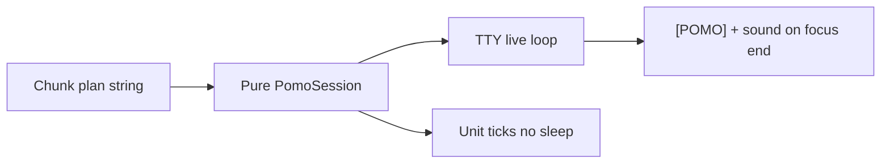

# Interactive multi-segment pomodoro

## Mission
CLI focus sessions you can steer live: pause, restart segment, reset plan — with explicit chunk plans (`20,4,20,4`) as the session contract.

## Thrive picture (2036 lens)



| Horizon piece | Role |
|---------------|------|
| Kernel | `pomo_plan_parse` + `pomo_session_*` pure state (seconds, pause, index) |
| Bridge | Live loop: select + raw keys when TTY; wall tick when not |
| Product edge | Help / plan banner / phase labels / focus log |

**Iron-peak:** pure session engine — any future UI (TUI, daemon, notify) reuses the same tick/control API.

## Optimal usage flow

| Intent | Command / key | Why |
|--------|---------------|-----|
| Classic single focus | `premflow pomo` or `pomo 25` | Zero ceremony |
| Structured block | `premflow pomo 25,5,25,5,25,15` | Encodes long-break after 3; no magic auto-rules |
| Labeled session | `premflow pomo 25 ship review PR` | Context shown live + written to `[POMO]` log |
| Context only | `premflow pomo deep work on auth` | Default 25m plan; label without typing minutes |
| Deep work day | `20,4,20,4,20,4,20,15` | Classic Pomodoro sequence as data |
| Interrupt | `space` / `p` | Freeze remaining; no lost progress |
| Segment botched | `r` | Restart **this** segment only |
| Whole plan again | `R` | Back to segment 1 full duration |
| Bail | `q` | Stop without inventing partial log |

**Design choice:** even index = focus, odd = break. User owns the cadence in the plan string (no hidden “after N pomos → long break” policy).

## Scorecard

| Capability | Grade | Evidence |
|------------|-------|----------|
| Chunk plan parse | A | `pomo_plan_parse("20,4,20,4")` + tests |
| Pause preserves remaining | A | `test_pomo_tick_and_pause` |
| Restart / reset | A | `test_pomo_restart_and_reset` |
| Segment advance + plan end | A | `test_pomo_segment_advance_and_plan_complete` |
| Live keys | B | TTY termios path; non-TTY still runs wall clock |
| Focus log + sound | A | On focus complete only (break = lighter message) |

## Guardrails

| Refuse | Build toward |
|--------|----------------|
| Auto long-break policy beyond plan | Plan-as-data multi-segment |
| Session resume after process death | In-process pause/reset |
| GUI / daemon | Pure engine extractable later |
| Tests that `sleep(1200)` | Tick API with injectable seconds |

## Verify

```bash
make test
./build/premflow                 # chunk plan + controls in help
./build/premflow pomo 20,4,20,4  # plan banner + live status
```

## References

| Source | Use |
|--------|-----|
| `src/core.c` | Engine + live loop |
| `src/premflow.h` | Public pomo API |
| `tests/test.c` | Parse / tick / controls |
| Classic Pomodoro (Cirillo) | 25/5 and 20/4 patterns as user plans |
