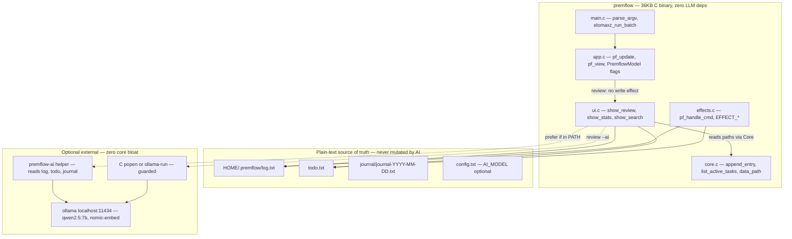
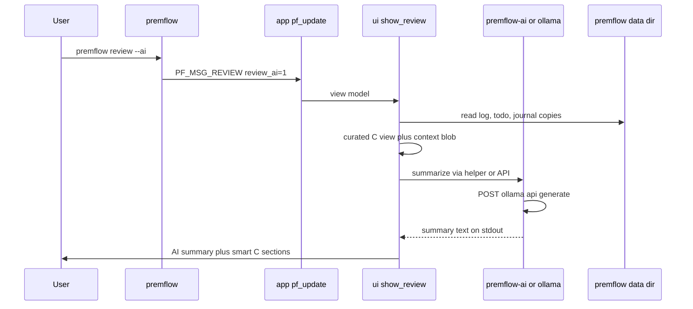

# Design: premflow v2 — Beyond Phase 1 Smart Review to Local-LLM-Augmented Reflection

**Author:** Grok (as systems architect, per delegated task)  
**Date:** 2026-06-03  
**Status:** Draft  
**Target:** premflow 0.3 (polish + AI stub) → 1.0 (direct LLM) → 2.0 ("premflow 2" ideal)

---

## Overview

premflow is a 36 KB pure-C one-shot CLI (src/main.c:39 using `elomaxz_run_batch`) for note/journal/todo/pomo/review/stats over plain-text append-only streams in `~/.premflow/{log.txt,todo.txt,journal/journal-YYYY-MM-DD.txt}`. Phase 1 (landed 2026-06-03 per `.stellarfusion/state.json`) upgraded the default `premflow review` from raw `tail -n 30` + uncurated todos (see pre-phase1 pain in state "quality_debt.review") to a curated view: `show_review` (src/ui.c:64) prioritizes pending todos (limited to 7 via `list_active_tasks` in core.c:280), extracts/highlights recent WIN/NOTE/DONE with ANSI+emoji sections (C_BOLD etc), counts POMO only (de-emphasized), and requires explicit `--full` for noisy raw tail+all (parse_argv:374 in src/app.c).

This design proposes the evolution past phase-1 polish into "premflow 2": richer pure-C heuristics for "what got done" + **optional, zero-bloat local LLM integration** (via ollama/llama.cpp, never in core binary) for auto-summarization of activity into journal-ready bullets, semantic search, "review coach" socratic questions, and drift detection vs. journal intentions. All while preserving the philosophy: "one small binary, human-editable plain files, $EDITOR integration, sounds, no bloat" (README, docs/architecture.md).

The core remains 100% C, zero runtime deps (beyond libc + fetched elomaxz), one ~36KB binary. LLM features are opt-in, external or shell-mediated, reading the same plain files.

---

## Background & Motivation

### Current State (Post-Phase 1)
- **MVU one-shot CLI**: `main.c:16` does `ensure_dirs + read_config`, `parse_argv` → single `PremflowMsg` → `elomaxz_run_batch(&prog, (Msg*)&msg, 1)` (see docs/architecture.md:102 and elomaxz.h runners). `pf_update` (app.c:98) is pure (emits `CMD_CUSTOM` + `EffectPayload` only for writes); `pf_view` (app.c:208) dispatches to `show_*` (ui.c) or `list_active_tasks` (core). Effects in `effects.c:8` (`pf_handle_cmd`).
- **Data model**: append-only `[YYYY-MM-DD HH:MM] [TYPE] text` in log.txt (NOTE/WIN/POMO/DONE); active `[ts] [TODO] ...` in todo.txt; per-day journal templates (effects.c:72 for creation). `append_entry:182` (core.c), `complete_task:315` (improved cleaning of embedded prefixes at 370: `strstr "[TODO]"` + fallback to second `]`).
- **Phase 1 review** (`show_review(int full)` ui.c:64):
  - Smart path (!full): copies `data_path` results to stack buffers (lines 68-80) to fix static aliasing hazard (core.c:48 `static char path[512]`; noted in .stellarfusion "data_path static buffer hazard", "fixed in review+search").
  - `list_active_tasks(todo_path, 7)` (shows raw `[ts][TODO]` lines + inner "📋 === Active Tasks ===" header; see core:298).
  - Log scan skips POMO (just `npomo++`), collects ≤12 each of WIN/NOTE/DONE, renders last N with stripping (e.g. 134: `strstr "[WIN]" +5`, ts strip).
  - Full: `system("tail -n 60 ...")` + `list_active_tasks(...,0)`.
- **Other pain points** (from .stellarfusion/state.json "quality_debt", user pre-phase1 intent, current runs):
  - Stats (`show_stats` ui.c:34): 4x `system("echo 'count'; grep -c '[POMO]' \"$log\"")` — order weird, no C path, header at bottom.
  - Search (ui.c:187): `system(grep -i -H --color ...)` — path:line output, header after results.
  - Todos in review: raw prefixes, no dedup (log has 20+ "Second task" from testing; see log.txt:19-86), no date bucketing.
  - No journal integration: manual templates (journal-*.txt), review output not fed back.
  - Review still "not very useful" for "what has been done" (pre-phase1: "POMO spam buries signal").
- **Binary**: 36KB (build/premflow; text 24k), ELF, no bloat.
- **Onboarding/prior**: efficient via list_dir + targeted read_file (README first, SKILL? no, src/main.c/app.c/core.c/ui.c + ~/.premflow/log.txt/todo.txt + .stellarfusion) + grep + run + state.json.

### Why Now / User Intent
"if it has info what has been done either manually added by dev or auto suggest from terminal history--may need local llm". Review must surface signal (wins, completions, focus) over noise. Phase 1 fixed the worst (curated default), but short-term polish + medium heuristics + long-term LLM (local-only) needed for "ideal next version (v2)".

Local LLM feasible here: ollama present (/usr/local/bin/ollama v0.20.5, qwen2.5:7b 4.7GB serving, nomic-embed-text), ~4s simple inference, all offline. No cloud ever.

---

## Goals & Non-Goals

### Goals
- **Short-term (0.3)**: Polish on phase1 so default review is *actionable* reflection surface. Pure-C only. Make stats/search use C paths. Eliminate raw prefixes/dedup/dates in display. Journal integration points. Remove system() from review full path. Always <50KB binary, tests pass, `make test`.
- **Medium (0.4-0.9)**: Heuristic "high value" scoring + daily buckets + focus metrics in review. Config-driven. `--pretty` stats.
- **Long-term / premflow 2**: Local LLM (ollama primary; llama.cpp fallback) for:
  - Auto-summarize day's (or --since) POMO+NOTE+WIN+DONE+pending into journal bullets.
  - "What got accomplished" synthesis (with opt-in limited terminal history from $HISTFILE).
  - Semantic search (`search --semantic` using embeddings).
  - Auto-tag/cluster + "review coach" (socratic Qs, drift from journal intentions).
- Preserve: plain-text source-of-truth forever (grep/edit/backup), one-shot CLI, elomaxz MVU, $EDITOR, sounds via config, offline guarantee.
- UX: `review` (smart C) stays default/fast; `review --ai` adds summary (2-10s); opt-in everything.
- Quantified: review <10ms (C), AI summary <10s (7B q4/q8 on typical dev hw), log growth ~100 lines/week, context window fit for recent 30-90d.
- 3-6 small incremental PRs, each buildable/testable/releasable (see PR Plan).

### Non-Goals
- Cloud LLMs, any network in core premflow binary (even for AI; helper must be local).
- Embedding llama.cpp/llama lib into main binary or increasing size >100KB.
- Changing data model to sqlite/structured (plain text + optional sidecars only).
- REPL / `elomaxz_run_with_msg_source` (docs/architecture.md rationale stays; one-shot).
- Auto-mutate logs/journals without explicit user `edit` or `journal` flow.
- Terminal history by default (privacy); no git log / other external scraping unless explicit future opt-in.
- Full structured output / RAG / agents in v1 (start with summarization + coach).
- Windows support (unix signals, paplay, $HOME, $EDITOR, popen assumed).

---

## Proposed Design

### High-Level Architecture
Keep existing layers (see current in docs/architecture.md:178 mermaid and main.c:25 ElomaxzProgram).

Add:
- Parse flags → model flags (review_ai, stats_pretty, etc.).
- For AI paths: optional `EFFECT_AI_REVIEW` (or handle purely in view for display-only like current REVIEW).
- New `show_review` branches + pure helpers in core/ui (e.g. `parse_log_entries`, `compute_focus_score`).
- **Decoupled AI**: never in core. Preferred: external `premflow-ai` helper (reads `data_path` files, calls ollama, emits markdown/text). Fallback: direct `popen("curl ...")` or `ollama run` in C (small, guarded by `if (access(ollama_bin, X_OK)==0)`).
- Sidecars (opt): `~/.premflow/index.jsonl` for embeddings (lazy built on first --semantic).



Sequence for `review --ai`:



### Short/Medium Term Polish (Pure C)
1. **Todo display**: Add `void list_active_tasks(const char *path, int max, int clean)` (or new `render_todo_line`). In review, use clean=1: strip `[ts] [TODO] ` prefix like we do for DONE in ui.c:167. Remove duplicate "📋 === ..." header when called from review (pass flag or split `print_pending_priorities` in ui.c).
2. **Dedup & quality**: In log scan (ui.c:115 loop, move to core later): for DONES, use `strstr` + hashset of last 20 cleaned texts or simple "if (strcmp(last, cur)==0 && strstr(cur,'Second task')) skip;". Count dups: "✔️ Second task (x12)".
3. **Date grouping**: Parse ts in review/stats/search. Group output:
   ```
   === 2026-06-03 ===
     ...
   === 2026-05-30 ===
   ```
   Use `strptime` or sscanf on `[2026-..` .
4. **Pure stats** (ui.c:34 → core.c new `void show_stats_c(void)` or `compute_counts(const char *log, int *pomo, ...)`): single pass fread or fgets, strstr counts, printf clean table with ANSI. Deprecate/remove system greps. Add "focus score" = (pomos * 0.6 + wins*2 + distinct_dones).
5. **C full review**: Replace `system(tail)` with `tail_in_c(FILE*, int n)` or just `fseek` + read last N lines (simple ring or two-pass count). No shell in review path.
6. **Journal bridge**: `parse_argv` support `journal --from-review` or new EFFECT_JOURNAL_FROM_REVIEW. In journal effect or new, append curated "From review (auto):" + top wins/dones to template before `open_editor`.
7. **Heuristics for "high value"**: In collection, score entry = (has '!' ? +10 : 0) + (len(text)>80 ? +5 :0) + recency + (WIN? +20 : DONE? +8). Surface top-scored first or badge `⭐ high value`.
8. **Config**: Extend `read_config` (core.c:107) for `AI_MODEL=qwen2.5:7b`, `AI_HELPER=premflow-ai`, `HISTORY_OPTIN=0`. Store in SoundConfig? or new AiConfig.

Example improved `list_active_tasks` sketch (to be in core.c):
```c
void list_active_tasks(const char *filepath, int max_to_show, bool clean) {
    ...
    while (fgets...) {
        char *disp = line;
        if (clean) {
            char *tag = strstr(line, "[TODO]");
            if (tag) disp = tag + 6;
            // ... trim ts etc, like complete_task:372
        }
        printf("%3d. %s", count, disp);
    }
}
```
Call from review: `list_active_tasks(..., 7, true);` from task list: `..., 0, false`.

Move log categorization to `core.c: int categorize_log(const char *path, char wins[][MAX_LINE], ...)` for reuse in stats/ai.

### Long-Term / Ideal v2 LLM Integration
- **Context building**: Limit to last 30-90 days or 200 entries + all pending + last journal entry. Strip POMO spam by default (or "X focus hours"). Include high-value only unless --full.
- **Prompts**: User-editable files `~/.premflow/prompts/review-summary.txt` (with {{LOG}} {{TODOS}} {{JOURNAL}} placeholders; simple str replace in helper/C). Default built-in conservative prompt: "You are a private daily reflection coach. NEVER invent facts. Quote directly. Output exactly: ## Accomplishments\n- ...\n## Focus\n...\n## Questions for you\n1. ..."
- **Semantic**: On `search --semantic "foo"`: if helper, `ollama embed nomic...` → cosine top-k over sidecar index (or live embed all recent since small). Sidecar format:
  ```
  {"ts":"2026-..","type":"WIN","text":"...","embed":[0.1, -0.3, ...]}
  ```
  Updated lazily: on ai cmd or new `premflow index --rebuild`.
- **Terminal history (opt-in)**: If config `INCLUDE_SHELL_HISTORY=1`, `tail -30 ${HISTFILE:-~/.bash_history} | grep -v -E 'pass|token|key|secret|export .*=' | ...`. Include as "Shell context (redacted, last 30, user-opted):". Warn on first use.
- **Coach / drift**: Prompt includes recent journal intentions ("🚀 Tomorrow's intention: X"). LLM: "You logged 12 pomos on infra but intention was 'family time' — drift score 4/10. Socratic: ...".
- **journal --ai**: Auto-fill sections from summary, then open editor (user reviews/edits).

**Risks (explicit)**:
- **Severity High**: Hallucinated "accomplishments" (mitigation: always show "Sources: last 5 log lines" + "LLM draft — edit before journal"; temperature 0.2; "cite exact phrases").
- **Med**: Slow first use / model unload (mit: keep_alive in API; document `ollama ps`; use small model default like 1.5B for coach).
- **Med**: Prompt injection via user notes (local only, user controls input; sanitize \`\`\` etc in context builder).
- **Low**: Sidecar index staleness (lazy + mtime check on log).
- **Privacy**: History opt-in + redaction; all localhost; no telemetry.

---

## API / Interface Changes

### Before (current post-phase1)
```
$ premflow review
📅 === Daily Review ...
📋 Pending Priorities...
  1. [2026-..] [TODO] foo
...
🏆 Wins
   ✨ bar
...
🍅 40 pomodoro sessions...
$ premflow stats
   🍅 ... (via 4 greps)
$ premflow search foo
/path/to/log.txt:line...
```

### After (incremental)
```
$ premflow review                 # polished C smart (todos cleaned, deduped, date-grouped, high-value badges, no shell)
$ premflow review --full          # C impl tail, all raw
$ premflow review --ai            # + "🤖 AI Summary (via qwen2.5:7b @ ollama, 4.3s)\n## What got done\n- ...\n## Coach asks:\n1. ...\n" then C sections below. Falls back gracefully if no ollama/helper.
$ premflow review ai              # alias via parse
$ premflow stats --pretty         # or default; pure C, focus score, date buckets, no system()
$ premflow stats                  # compatible or now pretty (add --raw)
$ premflow journal --from-review  # appends curated + (if --ai) LLM bullets to today's journal template, then $EDITOR
$ premflow search --semantic "spaceX"  # later v2
$ premflow ai review                # future top-level? (parse if argv[1]=="ai")
```

Extend `PremflowMsg` (struct in app.h, after review_full):
```c
int review_ai;     /* 1 = use local LLM summary */
int stats_pretty;
int journal_from_review; /* 1 = populate today's journal template from current review content before open_editor */
int journal_ai;          /* 1 = also request AI-curated bullets for the from-review section (implies from_review) */
```
In `parse_argv` (journal block and review block):
```c
} else if (strcmp(cmd, "journal") == 0) {
    msg->type = PF_MSG_JOURNAL;
    if (argc > 2) {
        if (strcmp(argv[2], "--from-review") == 0 || strcmp(argv[2], "from-review") == 0) {
            msg->journal_from_review = 1;
        }
        if (strcmp(argv[2], "--ai") == 0 || strcmp(argv[2], "ai") == 0 ||
            (argc > 3 && (strcmp(argv[3], "--ai")==0 || strcmp(argv[3],"ai")==0))) {
            msg->journal_from_review = 1;
            msg->journal_ai = 1;
        }
    }
} else if (strcmp(cmd, "review") == 0) {
    ...
    if (argc > 2) {
        ...
        if (strcmp(arg, "--ai") == 0 || strcmp(arg,"ai")==0) msg->review_ai = 1;
    }
} else if (strcmp(cmd,"stats")==0) {
    ...
    if (argc>2 && (strcmp(argv[2],"--pretty")==0 || strcmp(argv[2],"pretty")==0)) ...
}
```
In `pf_update` (JOURNAL case and REVIEW case):
```c
case PF_MSG_JOURNAL:
    emit_effect(cmds_out, num_cmds_out, EFFECT_JOURNAL, NULL, 0, 0);
    // Note: journal_from_review / journal_ai are carried in the PremflowMsg; pf_update is pure so we forward via a small extension or (preferred) by making EffectPayload richer and setting here:
    // Better: extend emit for journal or use payload fields (see below).
    return ...
case PF_MSG_REVIEW:
    {
        PremflowModel *rm = model_new(0, DISPLAY_REVIEW, NULL);
        if (rm) {
            rm->review_full = m->review_full;
            // review_ai forwarded similarly (for view path; ai summary may be in-view or effect)
        }
        return (Model) rm;
    }
```
(See EffectPayload extension below. For journal flags, since journal is effect-driven, the crossing happens in pf_update by populating EffectPayload from m->journal_* before emit_effect, or by emitting a new EFFECT_JOURNAL_FROM_REVIEW kind that carries the flags. Design chooses small extension to existing payload for simplicity.)

In `pf_view`: `show_review(m->review_full, m->review_ai);` (sig update; ai only affects view for now).

Update `show_help` (ui.c), cliconsolehelp.txt, README usage examples.

New effect kind if we move AI I/O to effects: `EFFECT_AI_REVIEW` (for consistency, even if display). For journal-from-review we will likely keep EFFECT_JOURNAL but extend its handling in effects (or add dedicated kind; see below).

---

## Data Model Changes

**None breaking.** Append-only text remains immutable source of truth. Users `edit log` / `edit todo` / `journal` as before.

**Optional sidecars (v2, lazy, never required):**
- `~/.premflow/ai-index.jsonl` (embeddings for semantic; append-only too; rebuildable).
- `~/.premflow/prompts/*.txt` (templates, gitignored or user managed).
- Temp files in /tmp for context/payloads (cleaned).

Migration: zero. Old logs work (ts parsing tolerant). `ensure_dirs` unchanged.

On append_entry (future hook?): if AI index enabled, append embedding? But to keep simple/no-deps in core, index only updated from AI helper or explicit `premflow index`.

---

## Alternatives Considered

### 1. Link llama.cpp directly (or via CMD_ML_TRAIN_STEP in elomaxz)
Embed gguf inference in premflow binary at build (`-DWITH_LLAMA -I llama.cpp ... -lllama`).

**Trade-offs**: Full offline, no external process, "one binary". But: binary size → 5-20+ MB (llama libs + ggml even static; see web research), startup latency 1-5s+ just for weights load *every* run (even non-AI cmds), C++ interop pain in pure C11, model files still separate huge download, violates "tiny clean" + "zero bloat" + 36KB target. elomaxz CMD_ML_ is for training step, not general. **Rejected** (high severity for philosophy).

### 2. Always shell ollama/curl directly in ui.c / core (no helper)
In `show_review(ai)`: `snprintf(prompt, ... "log:\n%s\n", recent); FILE *p = popen("curl -s -d '{\"model\":\"qwen2.5:7b\",\"prompt\":\"...\",\"stream\":false}' http://127.0.0.1:11434/api/generate | ...", "r");` then fgets response.

**Trade-offs**: Simple, no new artifacts, works if ollama running. Pros: one codebase. Cons: parsing JSON in C (brittle without cJSON dep — violates zero deps; use line-based or python -c one-liner which adds python dep), long prompts via cmdline risky (arg max), mixes AI concerns into ui/core (harder to test, review), output formatting tied to ollama ndjson, harder for users to customize prompts or swap backends (llama-cli direct). Still "bloat" in the sense of AI code in the tiny binary. **Considered but secondary** (use only as fallback when no `premflow-ai` in PATH).

### 3. External helper binary/script (chosen primary path)
Separate `premflow-ai` (or `pf-review-ai`) — can be:
- Python (using `requests` or `subprocess` + `ollama` python lib, or direct http; ~50 LOC).
- Go/Rust tiny static binary.
- Even a bash wrapper + jq.
Installed via `make install-ai` or pipx/brew separate, or in-tree `contrib/premflow-ai` (not linked into main build).
Interface contract: `premflow-ai --summarize --date=2026-06-03 --model=qwen2.5:7b --context-file=/tmp/ctx` → stdout only the formatted summary. Or reads env `PREMFLOW_DATA=~/.premflow`.
Main C detects via `which`/`access` or always tries exec, falls back.

**Trade-offs**:
- **Pros**: Core binary stays 36KB/zero-dep/pure-C forever. AI code can be rich (prompt mgmt, embeddings lib, nice json parse, tests). Users opt-in install. Easy evolution (swap ollama for local llama.cpp server). Matches "plain files" — helper is just another reader like `grep` or user's own scripts. Decouples release of premflow from AI models/prompts.
- **Cons**: "Two things to install" for full experience (but documented; graceful degradation). Version skew possible (mit: helper prints its version + requires protocol).
- **Why best**: Directly satisfies "how to add optional LLM without bloating the core binary or violating 'tiny clean'". "external helper binary/script that reads the plain files". Precedent in ecosystem for optional AI CLIs. Can even be user-written (any lang that can read txt + call local ollama).

Other considered: dlopen("libpfai.so") at runtime (complex ABI, still pulls code, startup cost, not simpler than exec). Compile-time two binaries `premflow` vs `premflow+ai` (CMake bloat, user confusion on which to run).

**Decision**: Primary = external helper (with C direct fallback for basic summarize using curl+popen+crude parse or `ollama run`). Document clearly. Phase rollout via stubs first.

---

## Security & Privacy Considerations

**Threat model**:
- Local attacker with FS read: can read all history (same as today; `chmod 700 ~/.premflow` recommended, as data dir is 755 now).
- LLM prompt injection via crafted NOTE/WIN: mitigated because (a) local model only, (b) we control/quote context, (c) output is draft not auto-applied, (d) user reviews in $EDITOR.
- Secrets in history: opt-in only + regex redaction (PASS|TOKEN|KEY|AWS|export .*SECRET) + warning "This will include recent shell commands. Review output before journaling."
- No network in premflow binary: even --ai path uses only localhost:11434 or exec local binary. curl in popen is to 127.0.0.1.
- Helper: if python, pin? but user responsibility; recommend static go binary for helper.
- Data handling: never uploads; all processing in-memory or /tmp (0600). No logging of full prompts by default (can add --debug that logs redacted).
- Config: AI_MODEL editable; users can point at their own ollama or airgapped.

**Auth**: None (local unix perms + ollama which has no auth by default; can be socket-activated).

**Rollback**: `git checkout` old binary; rm sidecars safe (rebuildable).

---

## Observability

Current: none (printf + stderr errors). Keep minimal.

- On AI use: `printf("🤖 Using %s via %s (%.1fs)\n", model, backend, dur);` (measure with `clock_gettime` around popen).
- Errors: "ollama not reachable (is `ollama serve` running? `ollama pull qwen2.5:7b`)" — actionable.
- Future: simple `~/.premflow/stats.json` append (but avoid for now; or just count in review header "processed 87 log entries").
- No metrics export. For debug: `PREMFLOW_DEBUG=1 premflow review --ai` prints context size, prompt path.
- Alerting: n/a (personal CLI).

Add to `PremflowRuntime` optional `ai_latency_ms`.

---

## Rollout Plan

**Feature "flags"**: runtime presence + config. No compile flags needed for core (always builds). AI is additive.

**Staged (slices keep system always buildable/testable/releasable)**:
1. **Phase1+ (now)**: Polish only (C changes). Ship in 0.3. `review --ai` stub prints "AI support coming in next slice; use --full or install ollama for now."
2. **Direct C path (ollama/curl minimal)**: Add to 0.4. Works if ollama in PATH + running. No new files.
3. **Helper contract + prefer helper**: Define stdout protocol, detection. Users can provide their own. Update README/install.
4. **Sidecar index + semantic + journal --ai**: v0.5+.
5. **Contrib reference impl + AUR?** + docs with screenshots of --ai output.
6. **"v2" tag + full coach/drift + history optin UI**: when stable.

**Testing**: Extend tests/test.c with temp log + `show_review`? (currently ui not unit tested; add via capture or refactor pure fns). Manual: `make && ./build/premflow review --ai` (with ollama). CI: no ollama, so stub path.

**Rollback**: Revert binary; AI features are read-only + opt-in.

**Quant load**: On typical day + 10-20 entries added; full history scan negligible (<1ms). LLM context: ~1-4k tokens for summary.

---

## Open Questions

- Exact helper binary name / install mech (`premflow-ai` vs `pf ai` subproc)? Prefer PATH discovery.
- Default model? qwen2.5:7b good balance (user has it), or smaller for speed (phi3:mini)? Make configurable day 1.
- Include POMO details in AI context by default, or "X hours focus" only? (user said pomo spam bad).
- Structured output from LLM (json via "format":"json" in API) vs free text + post-process? Structured better for journal auto-fill.
- Should `search` default to semantic when term looks "fuzzy", or explicit flag only?
- Terminal history redaction rules — how aggressive? User-editable patterns in config?
- Embeddings storage: jsonl ok, or simple sqlite for v3 (but non-goal for now)?
- Multi-day review `review --since 2026-05-01 --ai`?

---

## Key Decisions

1. **External helper is the only way to satisfy "tiny clean + optional LLM"** (see Alternatives; core never grows).
2. **Plain text + sidecars only** (editability/grep > query perf; log.txt will stay <100k lines for years for personal use).
3. **Ollama primary** (user already has; http easy; model management solved). llama.cpp direct exec as secondary for fully no-daemon.
4. **Graceful degradation + opt-in** everywhere (no AI surprises on `review`).
5. **C polish first, LLM second** (builds on phase1; addresses stellarfusion debt immediately).
6. **No changes to elomaxz usage or runner** (batch stays; CMD_ML_ unused).
7. Prompts/templates human-editable files (like config.txt sounds).

---

## PR Plan (Ordered, Incremental, Reviewable)

Execute in sequence; each small, passes `make test && make format-check`, updates relevant docs/README/help, has manual verification steps. Can be done with "execute-plan" later.

1. **PR: C Polish for Review + Todos + Dedup + Dates**  
   Files: src/ui.c (show_review, improve stripping, date groups, dedup logic in scan), src/core.c (extend list_active_tasks(..., bool clean), new helpers `strip_ts_and_tag`, `categorize_recent`), src/app.c (minor), tests/test.c (add log parsing unit tests), update help strings.  
   Goal: todos clean in review, no "Second task" spam, grouped output, list header deduped. `review --full` still works. No behavior change for non-review.

2. **PR: Pure-C Stats + Search + Full-Review (remove shells)**  
   Files: src/ui.c (replace show_stats/system, show_search/system with C impls using new core parsers), src/core.c (counts, search_in_c, tail_last_n_lines), app.h/model, tests.  
   Add `--pretty` (now default for stats). Verify counts match old grep on real ~/.premflow/log.txt. Remove  `system` calls from ui review/stats/search paths.

3. **PR: Journal Integration + Heuristics + Config AI Fields**  
   Files: src/effects.c (new EFFECT or extend JOURNAL), core.c (read last journal), ui.c (high-value scoring, badges in review), premflow.h/app.h (config fields), parse_argv for `journal --from-review`.  
   `premflow journal --from-review` appends section then edits. Focus score proto. Update .stellarfusion? No. Tests for new journal logic.

4. **PR: AI Stub + Parse + Graceful Path + Docs**  
   Files: src/app.{c,h} (review_ai flag), src/ui.c (if (ai) { printf stub or call basic_ollama_popen if present; } ), core.c (maybe read_ai_config), README.md, docs/architecture.md (add LLM section), cliconsolehelp.txt, help().  
   `review --ai` always works (stub or basic if ollama detected via which/popen("ollama --version")). Update version? 0.3. Add warning/privacy note. make test still green (no ollama in CI).

5. **PR: External Helper Contract + Prefer + Example**  
   Files: src/ui.c / effects (prefer execvp("premflow-ai", args) over direct; capture stdout), docs + README (install instructions for helper, "you can write your own"), contrib/premflow-ai (reference python using requests or subprocess + json, or even a 50-line C using libcurl? but prefer no; document "or use ollama run directly").  
   Contract spec in docs. Test matrix: with/without helper, with/without ollama. Update build? optional target?

6. **PR: Semantic + Sidecar + Coach Prompts + v2 Polish** (can split)  
   Files: new src/ai.c? (or keep in ui/core for small), index builder, semantic search path, prompt loading from ~/.premflow/prompts/, coach output, journal --ai, history opt-in redaction, update tests + full README examples + screenshots (if added). Tag as 2.0 prep.  
   Optional sidecar write. Ensure plain files still primary.

Each PR: small diff (<300 LOC), reviewable, cites this design, updates changelog implicitly via commits. After 1-3, system is already much better for "what got done" even without LLM.

---

## References

- Source: src/main.c:39 (elomaxz_run_batch), src/app.c:327 (parse_argv), src/app.c:190 (REVIEW), src/app.c:208 (pf_view), src/ui.c:64 (show_review), src/ui.c:34 (stats), src/ui.c:187 (search), src/core.c:48 (data_path), src/core.c:182 (append_entry), src/core.c:280 (list_active_tasks), src/core.c:315 (complete_task:370 cleaning), src/effects.c:8 (pf_handle_cmd), src/premflow.h, src/app.h.
- Data: `$HOME/.premflow/log.txt` (87 lines, many dups), todo.txt (13 pending), journal/.
- State: .stellarfusion/state.json (fused: MVU, log+todo, phase1 review, static hazard; debt: review medium, display, parsing).
- Docs: docs/architecture.md (full runner rationale, mermaids), README.md (philosophy, usage, 36KB implied).
- elomaxz: build/_deps/elomaxz-src/include/elomaxz.h (CMD_CUSTOM, run_batch).
- Local LLM: ollama (verified present + qwen2.5:7b + /api/generate), https://docs.ollama.com/api/generate (curl examples, stream:false, response field).
- Prior art: phase1 implementation (2026-06-03), user intent for "auto suggest from terminal history".
- Other: build/premflow (36K), tests/test.c (8 tests, no review coverage yet).

---

*This document is the output of thorough exploration per instructions. Ready for review/implementation slices.*
